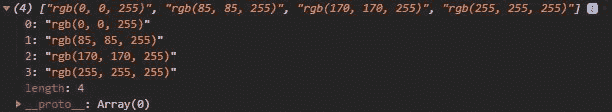
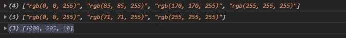

# D3.js 量化()功能

> 原文:[https://www.geeksforgeeks.org/d3-js-quantize-function/](https://www.geeksforgeeks.org/d3-js-quantize-function/)

**d3 .量化**功能用于生成均匀间隔的插值器样本并返回。这对于从给定插值器生成特定数量的样本很有用。

**语法:**

```
d3.quantize(interpolator, n);

```

**参数:**取以下两个参数。

*   **插值器:**是插值器功能。
*   **n:** 是给定插值器所需的样本数

**返回:**返回数组。**T3】**

**例 1:**

## 超文本标记语言

```
<!DOCTYPE html>
<html lang="en">

<head>
    <meta charset="UTF-8">
    <meta name="viewport" content=
        "width=device-width,initial-scale=1.0">

      <!--Fetching from CDN of D3.js -->
    <script type="text/javascript" 
        src="https://d3js.org/d3.v4.min.js">
    </script>
</head>

<body>

    <script>
        let interpolator =
            d3.interpolate("blue", "white");
        // Creating four samples 
        let samples = d3.quantize(interpolator, 4);
        console.log(samples)
    </script>
</body>

</html>
```

**输出:**



**例 2:**

## 超文本标记语言

```
<!DOCTYPE html>
<html lang="en">

<head>
    <meta charset="UTF-8">
    <meta name="viewport" content=
        "width=device-width,initial-scale=1.0">

    <!--Fetching from CDN of D3.js -->
    <script type="text/javascript" 
        src="https://d3js.org/d3.v4.min.js">
    </script>
</head>

<body>
    <div class="b1"></div>
    <div class="b2"></div>

    <script>
        let interpolator =
            d3.interpolate("blue", "white");
        let samples = d3.quantize(interpolator, 4);
        console.log(samples)

        // Using interpolateCubehelix
        interpolator =
            d3.interpolateCubehelix("blue", "white");
        samples = d3.quantize(interpolator, 3);
        console.log(samples)

        // Using interpolateRound
        interpolator =
            d3.interpolateRound((0, 1e3), 10);
        samples = d3.quantize(interpolator, 3);
        console.log(samples)
    </script>
</body>

</html>
```

**输出:**

