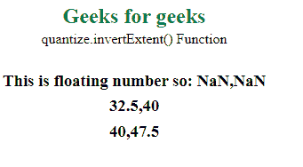
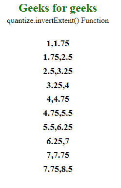

# D3.js 量化.反转范围()函数

> 原文:[https://www . geesforgeks . org/D3-js-quantize-invertext-function/](https://www.geeksforgeeks.org/d3-js-quantize-invertextent-function/)

**quantified . invertextend()**函数用于返回域[x0，x1]中存在的值的范围，对应范围内的值。

**语法:**

```
quantile.invertExtent(value);
```

**参数:**该函数采用上面给出并在下面描述的单个参数。

*   **值:**是对应于域值的数字。

**返回值:**该函数返回域中值的范围。

**例 1:**

## 超文本标记语言

```
<!DOCTYPE html>
<html lang="en">

<head>
    <meta charset="UTF-8" />
    <meta name="viewport" path1tent="width=device-width, 
        initial-scale=1.0" />
    <title>Geeks for geeks</title>
    <script src="https://d3js.org/d3.v4.min.js">
    </script>
    <script src="https://d3js.org/d3-color.v1.min.js">
    </script>
    <script src=
        "https://d3js.org/d3-interpolate.v1.min.js">
    </script>
    <script src=
        "https://d3js.org/d3-scale-chromatic.v1.min.js">
    </script>

    <style>
        body {
            line-height: 5px;
            text-align: center;
        }

        h2 {
            color: green;
        }

        h3 {
            line-height: 10px;
        }
    </style>
</head>

<body>
    <h2>Geeks for geeks</h2>
    <p>quantize.invertExtent() Function </p>

    <script>
        var object = d3.scaleQuantize()

            // Value from 10 to 100 decides 
            // which value to output
            .domain([10, 100])

            // This should be a number range.
            .range([11, 12, 13, 14, 15, 16, 
                    17, 18, 19, 10, 11, 12]);

        document.write("<br/>")
        document.write("<h3>This is floating "
                + "number so: "
                + object.invertExtent(14.44) 
                + "</h3>");
        document.write("<h3>" + 
            object.invertExtent(14) + "</h3>");
        document.write("<h3>" + 
            object.invertExtent(15) + "</h3>");
    </script>
</body>

</html>
```

**输出:**



**例 2:**

## 超文本标记语言

```
<!DOCTYPE html>
<html lang="en">

<head>
    <meta charset="UTF-8" />
    <meta name="viewport" path1tent="width=device-width, 
        initial-scale=1.0" />
    <title>Geeks for geeks</title>
    <script src="https://d3js.org/d3.v4.min.js">
    </script>
    <script src="https://d3js.org/d3-color.v1.min.js">
    </script>
    <script src=
        "https://d3js.org/d3-interpolate.v1.min.js">
    </script>
    <script src=
        "https://d3js.org/d3-scale-chromatic.v1.min.js">
    </script>

    <style>
        body {
            line-height: 5px;
            text-align: center;
        }

        h2 {
            color: green;
        }

        h3 {
            line-height: 10px;
        }
    </style>
</head>

<body>
    <h2>Geeks for geeks</h2>
    <p>quantize.invertExtent() Function </p>
    <script>
        var object = d3.scaleQuantize()

            // Value from 1 to 10 decides 
            // which value to output
            .domain([1, 10])
            .range([1, 2, 3, 4, 5, 6, 7, 
                8, 9, 10, 11, 12]);
        document.write("<br/>");

        document.write("<h3>" + 
            object.invertExtent(1) + "</h3>");
        document.write("<h3>" + 
            object.invertExtent(2) + "</h3>");
        document.write("<h3>" + 
            object.invertExtent(3) + "</h3>");
        document.write("<h3>" + 
            object.invertExtent(4) + "</h3>");
        document.write("<h3>" + 
            object.invertExtent(5) + "</h3>");
        document.write("<h3>" + 
            object.invertExtent(6) + "</h3>");
        document.write("<h3>" + 
            object.invertExtent(7) + "</h3>");
        document.write("<h3>" + 
            object.invertExtent(8) + "</h3>");
        document.write("<h3>" + 
            object.invertExtent(9) + "</h3>");
        document.write("<h3>" + 
            object.invertExtent(10) + "</h3>");
    </script>
</body>

</html>
```

**输出:**

