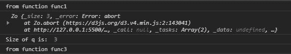
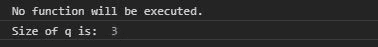

# D3.js 队列. abort()函数

> 原文:[https://www.geeksforgeeks.org/d3-js-queue-abort-function/](https://www.geeksforgeeks.org/d3-js-queue-abort-function/)

d3.js 中的 **queue.abort()** 函数用于中止延迟任务的每个功能。如果任何延迟的任务没有返回任何中止，它将继续执行。

**语法:**

```
queue.abort();

```

**参数:**此功能不接受任何参数。

**返回:**返回对象。

下面给出了上述函数的几个例子。

**示例 1:** 将执行某些函数调用。

## 超文本标记语言

```
<!DOCTYPE html> 
<html lang="en"> 
<head> 
    <meta charset="UTF-8"> 
    <meta name="viewport"
            path1tent="width=device-width, 
                       initial-scale=1.0"> 
    <title>Document</title> 
</head> 
<style> 
</style> 
<body> 
  <script src = 
"https://d3js.org/d3.v4.min.js"> 
  </script> 
  <script>
    function func1(){
      console.log("from function func1")
    }
    function func2(){
      console.log("from function func2")
    }
    function func3(){
      console.log("from function func3")
    }
    function func4(){
      setTimeout(func3, 500);
    }
    let q=d3.queue(3)
    q.defer(func1)
    q.defer(func4)
    q.abort()
    // This will not be executed.
    q.defer(func2)
    console.log(q)
    console.log("Size of q is: ",q._size)
  </script> 
</body> 
</html>
```

**输出:**



**例 2:** 不执行任何功能。

## 超文本标记语言

```
<!DOCTYPE html> 
<html lang="en"> 
<head> 
    <meta charset="UTF-8"> 
    <meta name="viewport"
            path1tent="width=device-width, 
                       initial-scale=1.0"> 
    <title>Document</title> 
</head> 
<style> 
</style> 
<body> 
  <script src = 
"https://d3js.org/d3.v4.min.js"> 
  </script> 
  <script>
    function func1(){
      console.log("from function func1")
    }
    function func2(){
      console.log("from function func2")
    }
    function func3(){
      console.log("from function func3")
    }
    function func4(){
      setTimeout(func3, 500);
    }
    let q=d3.queue(3)
    // Using abort function to force
    // every deferred function to return abort.
    q.abort()
    // These functions will not be executed.
    q.defer(func1)
    q.defer(func4)
    q.defer(func2)
    console.log("No function will be executed.")
    console.log("Size of q is: ",q._size)
  </script> 
</body> 
</html>
```

**输出:**

