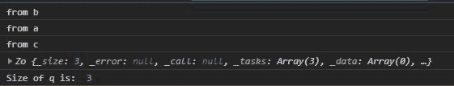
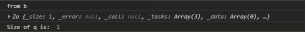

# D3 . js queue . delay()函数

> 原文:[https://www.geeksforgeeks.org/d3-js-queue-defer-function/](https://www.geeksforgeeks.org/d3-js-queue-defer-function/)

d3.js 中的**queue . delay()**函数用于将异步任务回调添加到队列中。其中任务是要执行的功能。任务完成后必须执行回调。

**语法:**

```
queue.defer(task[, arguments…]);

```

**参数:**该函数接受如上所述的单个参数，如下所述:

*   **任务:**是为执行特定任务而要执行的功能。

**返回值:**该函数返回对象。

下面给出了上述函数的几个例子。

**示例 1:** 当队列的大小等于 queue.defer()调用的数量时。

## 超文本标记语言

```
<!DOCTYPE html> 
<html lang="en"> 
<head> 
    <meta charset="UTF-8"> 
    <meta name="viewport"
            path1tent="width=device-width, 
                       initial-scale=1.0"> 
    <title>Document</title> 
</head> 
<style>
</style> 
<body> 
  <script src = 
"https://d3js.org/d3.v4.min.js"> 
  </script> 
  <script>
    function a(){
      console.log("from a")
    }
    function b(){
      console.log("from b")
    }
    function c(){
      console.log("from c")
    }
    let q=d3.queue(3)
    // Calling defer three times
    q.defer(b)
    q.defer(a)
    q.defer(c)
    console.log(q)
    console.log("Size of q is: ",q._size)
  </script> 
</body> 
</html>
```

**输出:**



**示例 2:** 当队列的大小小于队列时，delay()调用。

## 超文本标记语言

```
<!DOCTYPE html> 
<html lang="en"> 
<head> 
    <meta charset="UTF-8"> 
    <meta name="viewport"
            path1tent="width=device-width, 
                       initial-scale=1.0"> 
    <title>Document</title> 
</head> 
<style> 
</style> 
<body> 
  <script src = 
"https://d3js.org/d3.v4.min.js"> 
  </script> 
  <script>
    function a(){
      console.log("from a")
    }
    function b(){
      console.log("from b")
    }
    function c(){
      console.log("from c")
    }
    let q=d3.queue(1)
    // Calling defer three times but it will add only function
    // call b because the size of the queue is one.
    q.defer(b)
    q.defer(a)
    q.defer(c)
    console.log(q)
    console.log("Size of q is: ",q._size)
  </script> 
</body> 
</html>
```

**输出:**

