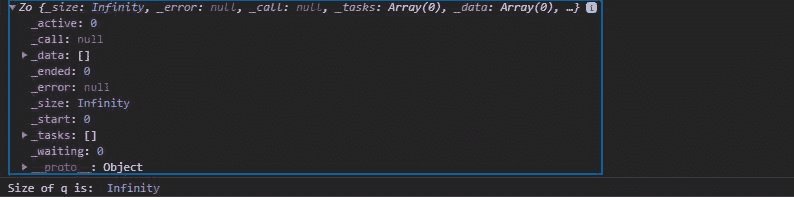
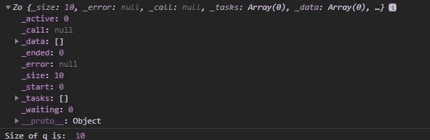

# D3.js 队列()功能

> 原文:[https://www.geeksforgeeks.org/d3-js-queue-function/](https://www.geeksforgeeks.org/d3-js-queue-function/)

**d3.queue()** 函数用于创建一个指定大小的队列。如果默认情况下没有给出大小，则认为它是无限的。

**语法:**

```
 d3.queue(size);

```

**参数:**该函数接受上面提到的和下面描述的单个参数:

*   **大小:**是可选参数，如果没有给定，那么队列的大小是无限的，否则队列的大小就是给定的数字。大小指定同时运行多少个函数。

**返回:**该函数返回对象。

下面给出了上述函数的几个例子。

**示例 1:** 当队列的大小没有默认给出时，它是无限大小的。

## 超文本标记语言

```
<!DOCTYPE html> 
<html lang="en"> 
<head> 
    <meta charset="UTF-8"> 
    <meta name="viewport"
            path1tent="width=device-width, 
                       initial-scale=1.0"> 
    <title>D3.js queue() Function</title> 
</head> 
<style> 
</style> 
<body>  
  <script src = 
"https://d3js.org/d3.v4.min.js"> 
  </script> 
  <script>
    let q=d3.queue()
    console.log(q)
    console.log("Size of q is: ",q._size)
  </script> 
</body> 
</html>
```

**输出:**



**例 2:** 给定队列大小时。

## 超文本标记语言

```
<!DOCTYPE html> 
<html lang="en"> 
<head> 
    <meta charset="UTF-8"> 
    <meta name="viewport"
            path1tent="width=device-width, 
                       initial-scale=1.0"> 
    <title>D3.js queue() Function</title> 
</head> 
<style> 
    h1 { 
        color: green; 
    } 
    svg{ 
        background-color: #f2f2f2; 
    } 
  .path2{ 
        stroke: #000; 
    }
</style> 
<body> 
  <div> 
    <svg width="100" height="100"> 
      <path class="path2"> 
    </svg>
  </div> 
  <script src = 
"https://d3js.org/d3.v4.min.js"> 
  </script> 
  <script>
    let q=d3.queue(10)
    console.log(q)
    console.log("Size of q is: ",q._size)
  </script> 
</body> 
</html>
```

**输出:**

