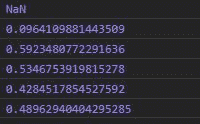
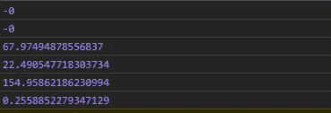

# D3.js randomBates()函数

> 原文:[https://www.geeksforgeeks.org/d3-js-randombates-function/](https://www.geeksforgeeks.org/d3-js-randombates-function/)

D3.js 中的 **randomBates()** 函数返回一个用于生成随机数的函数。返回的这个函数基于贝茨分布。

**语法:**

```
randomBates(n)

```

**参数:**该函数接受如上所述的单个参数，如下所述:

*   **n:** 它是与贝茨分布一起用于生成随机数的任何数字。

**返回:**返回函数。

下面给出了上述函数的几个例子。

**例 1:**

## 超文本标记语言

```
<!DOCTYPE html>
<html lang="en">
<head>
  <meta charset="UTF-8">
  <meta name="viewport" 
        content="width=device-width, initial-scale=1.0">
  <title>D3.js randomBates() Function</title>
</head>
<style>
</style>
<body>
  <!-- Fetching from CDN of D3.js -->
  <script type = "text/javascript" 
          src = "https://d3js.org/d3.v4.min.js">
  </script>
  <script>
    // Output may be different each time 
    // the function is run
    console.log(d3.randomBates(0)());  
    console.log(d3.randomBates(1)());  
    console.log(d3.randomBates(2)());  
    console.log(d3.randomBates(3)());  
    console.log(d3.randomBates(4)());  
    console.log(d3.randomBates(5)());  
  </script>
</body>
</html>
```

**输出:**



**例 2:**

## 超文本标记语言

```
<!DOCTYPE html>
<html lang="en">
<head>
  <meta charset="UTF-8">
  <meta name="viewport" 
        content="width=device-width, initial-scale=1.0">
  <title>D3.js randomBates() Function</title>
</head>
<style>
</style>
<body>
  <!-- Fetching from CDN of D3.js -->
  <script type = "text/javascript" 
          src = "https://d3js.org/d3.v4.min.js">
  </script>
  <script>
    // Output may be different each time 
    // the function is run
    console.log(d3.randomBates(-10)());  
    console.log(d3.randomBates(-1)(85)); 
    // Please note n is between 1 and 0 then 
    // random number 
    // Generated is greater than 1 
    console.log(d3.randomBates(0.0052)());  
    console.log(d3.randomBates(.0085)());  
    console.log(d3.randomBates(0.005)());  
    console.log(d3.randomBates(1.025)());  
  </script>
</body>
</html>
```

**输出:**

