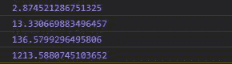

# D3.js randomExponential()函数

> 原文:[https://www . geesforgeks . org/D3-js-randomexponential-function/](https://www.geeksforgeeks.org/d3-js-randomexponential-function/)

**randomExponential()** 函数用于返回一个基于指数分布生成随机数的函数。

**语法:**

```
d3.randomExponential(lambda);
```

**参数:**只取一个上面给定，下面描述的参数。

*   **λ:**它是指数分布函数的速率，等于泊松过程中事件之间的时间。

**返回:**返回一个函数。

**注意:**每次运行功能时，输出的值可能不同。

下面给出了上述函数的几个例子。

**例 1:** 当λ大于 1 时。

```
<!DOCTYPE html>
<html lang="en">
<head>
  <meta charset="UTF-8">
  <meta name="viewport" 
        content="width=device-width,
                 initial-scale=1.0">
  <title>Document</title>
</head>
<style>
</style>
<body>
  <!-- Fetching from CDN of D3.js -->
  <script type = "text/javascript"
          src = "https://d3js.org/d3.v4.min.js">
  </script>
  <script>
    /*  The value of the output may be
 different each time the function is run.*/
    console.log(d3.randomExponential(5)())
    console.log(d3.randomExponential(5)())
    console.log(d3.randomExponential(5)())
    console.log(d3.randomExponential(5)())
    console.log(d3.randomExponential(5)())
  </script>
</body>
</html>
```

**输出:**


**例 2:** 当λ值小于 1 时。

```
<!DOCTYPE html>
<html lang="en">
<head>
  <meta charset="UTF-8">
  <meta name="viewport" 
        content="width=device-width, 
                 initial-scale=1.0">
  <title>Document</title>
</head>
<style>
</style>
<body>
  <!-- Fetching from CDN of D3.js -->
  <script type = "text/javascript" 
          src = "https://d3js.org/d3.v4.min.js">
  </script>
  <script>
    /*  The value of the output may be
 different each time the function is run.*/
    console.log(d3.randomExponential(0.5)())
/* Smaller the lamba greater the random value generated.
    console.log(d3.randomExponential(0.05)())
    console.log(d3.randomExponential(0.005)())
    console.log(d3.randomExponential(0.0005)())
  </script>
</body>
</html>
```

**输出:**

