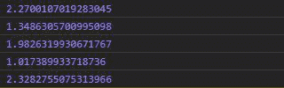
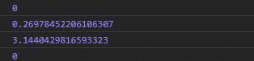

# D3.js 随机化吸入()函数

> 原文:[https://www . geesforgeks . org/D3-js-randomirwinhall-function/](https://www.geeksforgeeks.org/d3-js-randomirwinhall-function/)

d3.js 中的**D3 . randomitrwinhall()**函数用于基于具有“n”个独立变量的 IrwinHall 分布生成随机数。

**语法:**

```
d3.randomIrwinHall(n)

```

**参数:**它只取一个参数，如上所述，如下所述。

*   **n:** 是给予欧文霍尔分布函数的自变量个数。

**返回:**返回一个函数。

**例 1:** 当 n 大于零时。

## 超文本标记语言

```
<!DOCTYPE html>
<html lang="en">

<head>
    <meta charset="UTF-8">
    <meta name="viewport" content=
        "width=device-width,  
        initial-scale=1.0">
</head>

<body>
    <div class="b1"></div>
    <div class="b2"></div>

    <!--Fetching from CDN of D3.js -->
    <script type="text/javascript" 
        src="https://d3js.org/d3.v4.min.js">
    </script>

    <script>

        // Every output is different and 
        // generating the itwinhall random
        // numbers
        console.log(d3.randomIrwinHall(4)())
        console.log(d3.randomIrwinHall(4)())
        console.log(d3.randomIrwinHall(4)())
        console.log(d3.randomIrwinHall(4)())
        console.log(d3.randomIrwinHall(4)())
    </script>
</body>

</html>
```

**输出:**



**例 2:** 当 n 小于零时。

## 超文本标记语言

```
<!DOCTYPE html>
<html lang="en">

<head>
    <meta charset="UTF-8">
    <meta name="viewport" content=
        "width=device-width,initial-scale=1.0">
</head>

<body>
    <div class="b1"></div>
    <div class="b2"></div>

    <!--Fetching from CDN of D3.js -->
    <script type="text/javascript" 
        src="https://d3js.org/d3.v4.min.js">
    </script>

    <script>

        // Any value less than zero gives
        // static value of zero
        console.log(d3.randomIrwinHall(-4)())
        console.log(d3.randomIrwinHall(0.004)())
        console.log(d3.randomIrwinHall(4)(4))
        console.log(d3.randomIrwinHall(-0.008)())
    </script>
</body>

</html>
```

**输出:**

