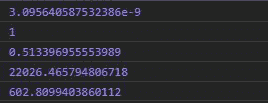
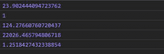

# D3.js randomLogNormal()函数

> 原文:[https://www . geeksforgeeks . org/D3-js-randomlognormal-function/](https://www.geeksforgeeks.org/d3-js-randomlognormal-function/)

**d3.randomLogNormal()** 函数用于基于对数-normal 函数生成随机数。

**语法:**

```
d3.randomLogNormal(mu,sigma);

```

**参数:**该函数接受两个参数，如上所述，如下所述:

*   **μ:**是随机变量的期望值。
*   **西格玛:**这个数字是用一个给定的标准偏差(称为西格玛)生成的。

**返回:**返回一个函数。

**注意:**如果没有给出 mu 和σ，那么默认情况下 mu 等于 0，σ等于 1。

下面给出了上述函数的几个例子。

**示例 1:** 每次执行功能时，输出可能不同。

## 超文本标记语言

```
<!DOCTYPE html>
<html lang="en">
<head>
  <meta charset="UTF-8">
  <meta name="viewport" 
        content="width=device-width, initial-scale=1.0">
  <title>Document</title>
</head>
<style>
</style>
<body>
  <!-- Fetching from CDN of D3.js -->
  <script type = "text/javascript" 
          src = "https://d3js.org/d3.v4.min.js">
  </script>
  <script>
    // Output may be different each time 
    // the function is run
    console.log(d3.randomLogNormal(2,10)())
    console.log(d3.randomLogNormal(0,0)())
    console.log(d3.randomLogNormal(1,12)())
    console.log(d3.randomLogNormal(10,0)())
    console.log(d3.randomLogNormal(5,1)())
  </script>
</body>
</html>
```

**输出:**



**例 2:**

## 超文本标记语言

```
<!DOCTYPE html>
<html lang="en">
<head>
  <meta charset="UTF-8">
  <meta name="viewport" 
        content="width=device-width, initial-scale=1.0">
  <title>Document</title>
</head>
<style>
</style>
<body>
  <!-- Fetching from CDN of D3.js -->
  <script type = "text/javascript" 
          src = "https://d3js.org/d3.v4.min.js">
  </script>
  <script>
    // Output may be different each time 
    // the function is run
    console.log(d3.randomLogNormal(2,10)(1))
    console.log(d3.randomLogNormal(0,0)(2))
    console.log(d3.randomLogNormal(1,12)(3))
    console.log(d3.randomLogNormal(10,0)(0))
    // When mu and sigma is not given
    console.log(d3.randomLogNormal()())
  </script>
</body>
</html>
```

**输出:**

