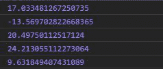
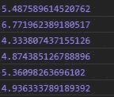

# D3.js randomNormal()函数

> 原文:[https://www.geeksforgeeks.org/d3-js-randomnormal-function/](https://www.geeksforgeeks.org/d3-js-randomnormal-function/)

**randomNormal()** 函数用于返回基于正态分布或高斯分布给出随机数的函数。

**语法:**

```
d3.randomNormal(mu, sigma);
```

**参数:**取上面给定和下面描述的两个参数。

*   **亩:**是数字的期望值。如果没有给出 mu，那么它被认为是 0。
*   **西格玛:**这个数是用一定的标准差产生的，称为西格玛。

**返回:**返回一个函数。

下面给出了上述函数的几个例子。

**例 1:** 当给定μ时。

```
<!DOCTYPE html>
<html lang="en">
<head>
  <meta charset="UTF-8">
  <meta name="viewport" 
        content="width=device-width,
                 initial-scale=1.0">
  <title>Document</title>
</head>
<style>
</style>
<body>
  <!-- Fetching from CDN of D3.js -->
  <script type = "text/javascript" 
          src = "https://d3js.org/d3.v4.min.js">
   </script>
  <script>
// The ouput may be different on different machines.
    console.log(d3.randomNormal(10, 10)())
    console.log(d3.randomNormal(10, 10)())
    console.log(d3.randomNormal(10, 10)())
    console.log(d3.randomNormal(10, 10)())
    console.log(d3.randomNormal(10, 10)())
  </script>
</body>
</html>
```

**输出:**



**例 2:** 未给 mu 时。

```
<!DOCTYPE html>
<html lang="en">
<head>
  <meta charset="UTF-8">
  <meta name="viewport" 
        content="width=device-width, 
                 initial-scale=1.0">
  <title>Document</title>
</head>
<style>
</style>
<body>
  <!-- Fetching from CDN of D3.js -->
  <script type = "text/javascript" 
          src = "https://d3js.org/d3.v4.min.js">
  </script>
  <script>
// The ouput may be different on different machines.
    console.log(d3.randomNormal(5)())
    console.log(d3.randomNormal(5)())
    console.log(d3.randomNormal(5)())
    console.log(d3.randomNormal(5)())
    console.log(d3.randomNormal(5)())
    console.log(d3.randomNormal(5)())
  </script>
</body>
</html>
```

**输出:**

