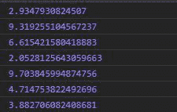
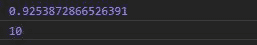

# D3.js randomUniform()函数

> 原文:[https://www.geeksforgeeks.org/d3-js-randomuniform-function/](https://www.geeksforgeeks.org/d3-js-randomuniform-function/)

D3.js 中的 **randomUniform()** 函数用于返回特定范围内的随机数。该范围由最大值和最小值定义。

**语法:**

```
d3.randomUniform(min, max);

```

**参数:**取两个参数，如上所述，如下所述:

*   **min:** 是可能的随机数的最小值。
*   **max:** 是可能的随机数的最大值。

**返回值:**返回给定范围内的随机数。

**注意:**代码每次执行输出都会不一样。

下面给出了上述函数的几个例子。

**例 1:** 给定最小和最大范围时。

## 超文本标记语言

```
<!DOCTYPE html>
<html lang="en">

<head>
    <meta charset="UTF-8">
    <meta name="viewport" content=
        "width=device-width, initial-scale=1.0">
</head>

<body>

    <!-- Fetching from CDN of D3.js -->
    <script type="text/javascript" 
        src="https://d3js.org/d3.v4.min.js">
    </script>

    <script>

        // Random number between 1 and 10
        console.log(d3.randomUniform(1, 10)())
        console.log(d3.randomUniform(1, 10)())
        console.log(d3.randomUniform(1, 10)())
        console.log(d3.randomUniform(1, 10)())
        console.log(d3.randomUniform(1, 10)())
        console.log(d3.randomUniform(1, 10)())
        console.log(d3.randomUniform(1, 10)())
    </script>
</body>

</html>
```

**输出:**



**例 2:** 当最小值和最大值相等时

## 超文本标记语言

```
<!DOCTYPE html>
<html lang="en">

<head>
    <meta charset="UTF-8">
    <meta name="viewport" content=
        "width=device-width, initial-scale=1.0">
</head>

<body>
    <!-- Fetching from CDN of D3.js -->
    <script type="text/javascript" 
        src="https://d3js.org/d3.v4.min.js">
    </script>

    <script>

        // Random number less then 10 and
        // greate than 0
        console.log(d3.randomUniform(10)())

        // Random number equal to 10
        console.log(d3.randomUniform(10, 10)())
    </script>
</body>

</html>
```

**输出:**每次执行代码时输出可能不同。

