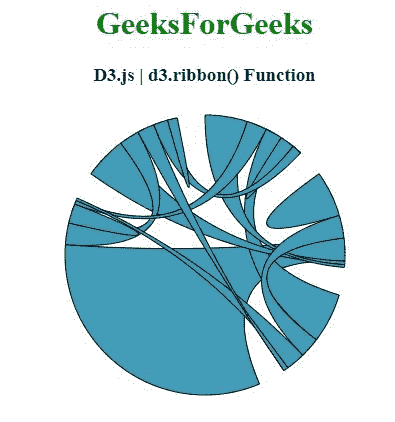
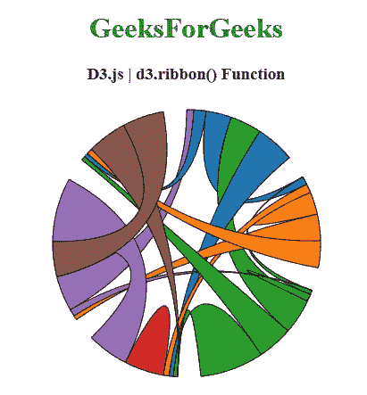

# D3.js 色带()功能

> 原文:[https://www.geeksforgeeks.org/d3-js-ribbon-function/](https://www.geeksforgeeks.org/d3-js-ribbon-function/)

**D3.js** 中的 **d3.ribbon()** 功能用于以默认设置返回已构建的新色带生成器。

**语法:**

```
d3.ribbon();

```

**参数:**此功能不接受任何参数。

**返回值:**该函数返回新构造的色带生成器。

以下程序说明了 **D3.js** 中的 **d3.ribbon()** 功能

**例 1:**

## 超文本标记语言

```
<!DOCTYPE html> 
<html> 
<head> 
  <meta charset="utf-8">
  <script src="https://d3js.org/d3.v4.js"></script>
</head> 
<body>
  <center> 
    <h1 style="color:green;">GeeksForGeeks</h1>
    <h3>D3.js | d3.ribbon() Function</h3>
    <div id="GFG"></div>
    <script>
      // Create the svg area
      var svg = d3.select("#GFG")
          .append("svg")
          .attr("width", 300)
          .attr("height", 300)
          .append("g")
          .attr("transform", "translate(150,150)");

      // Create input data
      var data = [[ 51, 148, 60, 71, 34, 5, 1],
                  [ 10, 161, 80, 80, 12, 34, 53],
                  [175,  71, 16, 68, 0, 0, 3],
                  [ 13, 990,  9, 69, 76, 35, 4],
                  [ 51, 148, 60, 71, 34, 5, 1]];

      // Give this matrix to d3.chord()
      var chords = d3.chord()
          .padAngle(0.2) 
          .sortSubgroups(d3.descending)
          .sortChords(d3.descending)
          (data);

      // Use of d3.ribbon() function
      var ribboon = d3.ribbon().radius(140);  

      svg.datum(chords)
          .append("g")
          .selectAll("path")
          .data(function (d) { return d; })
          .enter()
          .append("path")
          .attr("d", ribboon)
          .style("fill", "#449db8")
          .style("stroke", "black");
    </script> 
  </center>
</body> 
</html>
```

**输出:**



**例 2:**

## 超文本标记语言

```
<!DOCTYPE html> 
<html>      
<head> 
  <meta charset="utf-8">
  <script src= 
      "https://d3js.org/d3.v4.min.js">
  </script>  
  <script src= 
      "https://d3js.org/d3-scale-chromatic.v1.min.js">
  </script>
</head> 
<body> 
  <center> 
    <h1 style="color:green;">GeeksForGeeks</h1>
    <h3>D3.js | d3.ribbon() Function</h3>
    <div id="GFG"></div>
    <script>
      // Create the svg area
      var svg = d3.select("#GFG")
          .append("svg")
          .attr("width", 320)
          .attr("height", 320)
          .append("g")
          .attr("transform", "translate(160,160)");

      // Create input data
      var data = [[0,  58, 71, 89, 16, 28, 68],
                  [ 19, 51, 0, 20, 60, 61, 71],
                  [ 80, 10, 16, 145, 0, 80, 45],
                  [ 10, 13,   9, 90,  94, 0, 0],
                  [ 80, 10, 16, 145, 0, 80, 45],
                  [ 10, 13,   9, 90,  94, 0, 0]];

      // 4 groups, so create a vector of 4 colors
      var colors = [d3.schemeCategory10[0], 
          d3.schemeCategory10[1],
          d3.schemeCategory10[2], d3.schemeCategory10[3],
          d3.schemeCategory10[4], d3.schemeCategory10[5],
          d3.schemeCategory10[6], d3.schemeCategory10[7]];

      // Give this matrix to d3.chord()
      var chords = d3.chord()
          .padAngle(0.175)
          .sortSubgroups(d3.ascending)
          (data);

      svg.datum(chords)
          .append("g")
          .selectAll("path")
          .data(function (d) { return d; })
          .enter()
          .append("path")
          .attr("d", d3.ribbon()
              .radius(150)
          )
          .style("fill", function (d) { 
              return (colors[d.source.index])
          })
          .style("stroke", "black");
    </script> 
  </center>
</body>
</html>
```

**输出:**

