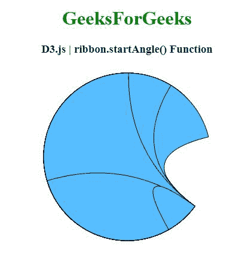
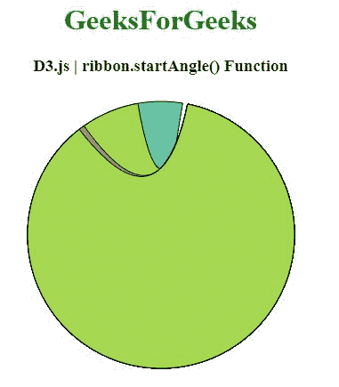

# D3.js ribbon.startAngle()函数

> 原文:[https://www . geesforgeks . org/D3-js-ribbon-startangle-function/](https://www.geeksforgeeks.org/d3-js-ribbon-startangle-function/)

**D3.js** 中的 **ribbon.startAngle()** 函数用于将 startAngle 访问器设置为指定的函数，并返回该 ribbon 生成器。

**语法:**

```
ribbon.startAngle([angle]);
```

**参数:**该函数接受一个参数，如上所述，如下所述

*   **角度:**该参数是设置起始角度取值器的弧度值。

**返回值:**该函数返回色带生成器。

以下程序说明了 **D3.js** 中的**功能**

**例 1:**

```
<!DOCTYPE html> 
<html> 

<head> 
    <meta charset="utf-8">
    <script src="https://d3js.org/d3.v4.js"></script>
</head> 

<body>
    <center> 
        <h1 style="color:green;">GeeksForGeeks</h1>

        <h3>D3.js | ribbon.startAngle() Function</h3>
        <div id="GFG"></div>

        <script>
            // Create the svg area
            var svg = d3.select("#GFG")
                .append("svg")
                .attr("width", 300)
                .attr("height", 300)
                .append("g")
                .attr("transform", "translate(150, 150)")

            // Create input data
            var data = [[18, 6, 1, 4, 5, 1],
                [ 0, 80, 0, 2, 34, 53],
                [75, 16, 8, 0, 0, 3],
                [3, 9, 9, 6, 35, 4],
                [1, 0, 7, 3, 5, 1]];

            // Give this matrix to d3.chord()
            var chords = d3.chord()
                .padAngle(0.2) 
                .sortSubgroups(d3.ascending)
                .sortChords(d3.ascending)
                (data)

            var ribboon = d3.ribbon().radius(140)  

                // Use of ribbon.startAngle() function
                .startAngle(2.2);

            svg.datum(chords)
                .append("g")
                .selectAll("path")
                .data(function (d) { return d; })
                .enter()
                .append("path")
                .attr("d", ribboon)
                .style("fill", "#57beff")
                .style("stroke", "black");
        </script> 
    </center>
</body> 

</html>
```

**输出:**



**例 2:**

```
<!DOCTYPE html> 
<html>

<head> 
    <meta charset="utf-8">

    <script src= "https://d3js.org/d3-color.v1.min.js">
    </script>  
    <script src= 
        "https://d3js.org/d3-interpolate.v1.min.js">
    </script>  
    <script src= 
        "https://d3js.org/d3-scale-chromatic.v1.min.js">
    </script>
</head> 

<body> 
    <center> 
        <h1 style="color:green;">GeeksForGeeks</h1>

        <h3>D3.js | ribbon.startAngle() Function</h3>
        <div id="GFG"></div>

        <script>
            // Create the svg area
            var svg = d3.select("#GFG")
                .append("svg")
                .attr("width", 320)
                .attr("height", 320)
                .append("g")
                .attr("transform", "translate(160, 160)")

            // Create input data
            var data = [[0, 249, 747, 555, 373],
                        [77, 0, 451, 33, 998],
                        [108, 809, 253, 40, 89],
                        [453, 592, 748, 477, 423],
                        [672, 66, 8, 2, 31]];

            // 4 groups, so create a vector of 4 colors
            var colors = [d3.schemeSet2[0], d3.schemeSet2[1],
                d3.schemeSet2[2], d3.schemeSet2[3],
                d3.schemeSet2[4], d3.schemeSet2[5],
                d3.schemeSet2[6], d3.schemeSet2[7]];

            // Give this matrix to d3.chord()
            var chords = d3.chord()
                .padAngle(0.175)
                .sortSubgroups(d3.ascending)
                (data)

            var rib = d3.ribbon().radius(150)

                // Use of ribbon.startAngle() function
                .startAngle(0.2);

            svg.datum(chords)
                .append("g")
                .selectAll("path")
                .data(function (d) { return d; })
                .enter()
                .append("path")
                .attr("d", rib)
                .style("fill", function (d) { 
                    return (colors[d.source.index])
                })
                .style("stroke", "black");
        </script> 
    </center>
</body>

</html>
```

**输出:**

