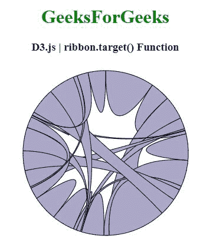
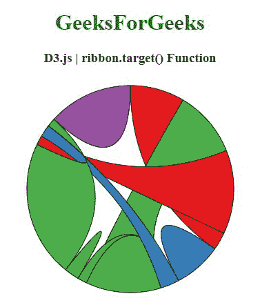

# D3.js ribbon.target()函数

> 原文:[https://www.geeksforgeeks.org/d3-js-ribbon-target-function/](https://www.geeksforgeeks.org/d3-js-ribbon-target-function/)

**D3.js** 中的 **ribbon.target()** 函数用于将目标访问器设置为指定的函数，并返回该 ribbon 生成器。

**语法:**

```
ribbon.target([target]);
```

**参数:**该函数接受如上所述的单个参数，如下所述:

*   **目标:**该参数是设置目标取值器的功能。

**返回值:**该函数返回色带生成器。

以下程序说明了 **D3.js** 中的**功能**

**例 1:**

## 超文本标记语言

```
<!DOCTYPE html> 
<html> 
<head> 
  <meta charset="utf-8">
  <script 
      src="https://d3js.org/d3.v4.js">
  </script>
</head> 
<body>
  <center> 
    <h1 style="color:green;">GeeksForGeeks</h1>
    <h3>D3.js | ribbon.target() Function</h3>
    <div id="GFG"></div>
    <script>
      // Create the svg area
      var svg = d3.select("#GFG")
          .append("svg")
          .attr("width", 300)
          .attr("height", 300)
          .append("g")
          .attr("transform", "translate(150,150)")

      // Create input data
      var data = [[148, 60, 71, 34, 5, 1],
                  [ 10, 80, 80, 12, 34, 53],
                  [175, 16, 68, 0 , 0, 3],
                  [13, 9, 69, 76, 35, 4],
                  [51, 60, 71, 34, 5, 1],
                  [ 10, 80, 80, 12, 34, 53]];

      // Give this matrix to d3.chord()
      var chords = d3.chord()(data)

      var ribbon = d3.ribbon().radius(140);  

      // Use of ribbon.target() function
      ribbon({
        source: {startAngle: 0.7524114, 
                  endAngle: 1.1212972},
        target: {startAngle: 1.8617078, 
                   endAngle: 1.9842927}
      });
      svg.datum(chords)
         .append("g")
         .selectAll("path")
         .data(function (d) { return d; })
         .enter()
         .append("path")
         .attr("d", ribbon)
         .style("fill", "#aba7c9")
         .style("stroke", "black");
    </script> 
  </center>
</body> 
</html>
```

**输出:**



**例 2:**

## 超文本标记语言

```
<!DOCTYPE html> 
<html>      
<head> 
  <meta charset="utf-8">
  <script src=
"https://cdnjs.cloudflare.com/ajax/libs/d3/4.2.2/d3.min.js">
  </script>
  <script src= 
      "https://d3js.org/d3-color.v1.min.js">
  </script>   
  <script src= 
      "https://d3js.org/d3-scale-chromatic.v1.min.js">
  </script>
</head> 
<body> 
  <center> 
    <h1 style="color:green;">GeeksForGeeks</h1>   
    <h3>D3.js | ribbon.target() Function</h3>
    <div id="GFG"></div>
    <script>
      // Create the svg area
      var svg = d3.select("#GFG")
          .append("svg")
          .attr("width", 320)
          .attr("height", 320)
          .append("g")
          .attr("transform", "translate(160,160)")

      // Create input data
      var data = [[0,  58, 71, 89, 16, 28, 68],
                  [ 19, 51, 0, 20, 60, 61, 71],
                  [ 80, 10, 16, 145, 0, 80, 45],
                  [ 10, 13,  9, 90,  94, 0, 0]];

      // 4 groups, so create a vector of 4 colors
      var colors = [d3.schemeSet1[0], d3.schemeSet1[1],
                    d3.schemeSet1[2], d3.schemeSet1[3],
                    d3.schemeSet1[4], d3.schemeSet1[5],
                    d3.schemeSet1[6], d3.schemeSet1[7]];

      // Give this matrix to d3.chord()
      var chords = d3.chord()(data)

      var rib = d3.ribbon().radius(150);

      // Use of ribbon.target() function
      rib({
        source: {startAngle: 0.7, endAngle: 1.2},
        target: {startAngle: 1.6, endAngle: 1.9}
      });

      svg.datum(chords)
          .append("g")
          .selectAll("path")
          .data(function (d) { return d; })
          .enter()
          .append("path")
          .attr("d", rib)
          .style("fill", function (d) { 
              return (colors[d.source.index])
          })
          .style("stroke", "black");
    </script> 
  </center>
</body> 
</html>
```

**输出:**

