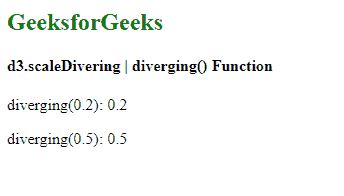

# D3 . js scale diffusing()函数

> 原文:[https://www . geesforgeks . org/D3-js-scale diverging-diverging-function/](https://www.geeksforgeeks.org/d3-js-scalediverging-diverging-function/)

**发散音阶**与连续音阶非常相似。唯一的区别是，该标尺的输出范围由插值器固定，因此该范围不可配置。

d3.scaleDiverging()的**diffusing()**函数用于返回一个范围内的值，该范围对应于必须位于指定域内的给定输入值。

**语法:**

```
diverging(value);
```

**参数:**该函数接受如上所述的单个参数，如下所述:

*   **值:**从指定的域中获取一个值。

**返回值:**该函数返回一个对应于默认范围的值。

**示例:**

## 超文本标记语言

```
<!DOCTYPE html>
<html lang="en">

<head>
    <meta charset="UTF-8" />
    <meta name="viewport" path1tent=
        "width=device-width, initial-scale=1.0" />

    <script src="https://d3js.org/d3.v6.min.js">
    </script>
</head>

<body>
    <h2 style="color:green"> GeeksforGeeks </h2>

    <h4> d3.scaleDivering | diverging() Function </h4>
    <script>
        var diverging = d3.scaleDiverging();
        // Default scale is identity function

        // Printing value using diverging() Function
        document.write("<p>diverging(0.2): ", 
                    diverging(0.2) + "</p>");
        document.write("<p>diverging(0.5): ", 
                    diverging(0.5) + "</p>");
    </script>
</body>

</html>
```

**输出:**

[](https://media.geeksforgeeks.org/wp-content/uploads/20200824101854/01150.png)