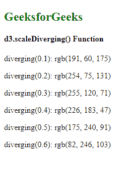

# D3.js scaleDiverging()函数

> 原文:[https://www . geesforgeks . org/D3-js-scale diverging-function/](https://www.geeksforgeeks.org/d3-js-scalediverging-function/)

**D3.js** 中的 **d3.scaleDiverging()** **函数**用于构造并返回一个指定域和固定范围的 diverging scale。**发散音阶**与连续音阶非常相似。唯一的区别是，该标尺的输出范围由插值器固定，因此该范围不可配置。

**语法:**

```
d3.scaleDiverging( domain, interpolator )

```

**参数:**上述函数接受两个参数，如上所述，如下所述:

*   **域:**这是最大和最小输入值范围。这是一个可选参数。默认域是[0，1]
*   **插值器:**这需要插值器功能。这是一个可选参数。默认函数是标识函数。

**返回值:**这个函数不返回任何东西。

下面是上面给出的函数的几个例子。

**例 1:**

## 超文本标记语言

```
<!DOCTYPE html>
<html>

<head>
    <script src="https://d3js.org/d3.v6.min.js">
    </script>
</head>

<body>
    <h2 style="color:green">
        GeeksforGeeks
    </h2>
    <h4> d3.scaleDiverging() Function </h4>

    <script>
        var diverging =
            d3.scaleDiverging(
                d3.interpolateSpectral
            );

        // Default domain is used i.e [0, 1]
        document.write(" <p>diverging(0.1): ",
                    diverging(0.1) + "</p>");
        document.write("<p>diverging(0.2): ",
                    diverging(0.2) + "</p>");
        document.write("<p>diverging(0.3): ",
                    diverging(0.3) + "</p>");
        document.write("<p>diverging(0.4): ",
                    diverging(0.4) + "</p>");
        document.write("<p>diverging(0.5): ",
                    diverging(0.5) + "</p>");
        document.write("<p>diverging(0.6): ",
                    diverging(0.6) + "</p>");
    </script>
</body>

</html>
```

**Output:**
[](https://media.geeksforgeeks.org/wp-content/uploads/20200823224210/01142.png)

**例 2:**

## 超文本标记语言

```
<!DOCTYPE html>
<html>

<head>
    <script src="https://d3js.org/d3.v6.min.js">
    </script>
</head>

<body>
    <h2 style="color:green">
        GeeksforGeeks
    </h2>
    <h4> d3.scaleDiverging() Function </h4>

    <script>
        var diverging = d3.scaleDiverging(
            d3.interpolateRainbow
        );

        // Default domain is used i.e [0, 1]
        document.write("<p>diverging(0.1): ",
                    diverging(0.1) + "</p>");
        document.write("<p>diverging(0.2): ",
                    diverging(0.2) + "</p>");
        document.write("<p>diverging(0.3): ",
                    diverging(0.3) + "</p>");
        document.write("<p>diverging(0.4): ",
                    diverging(0.4) + "</p>");
        document.write("<p>diverging(0.5): ",
                    diverging(0.5) + "</p>");
        document.write("<p>diverging(0.6): ",
                    diverging(0.6) + "</p>");
    </script>
</body>

</html>
```

**输出:**

