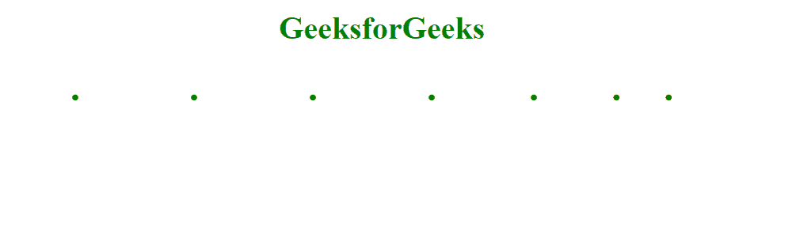
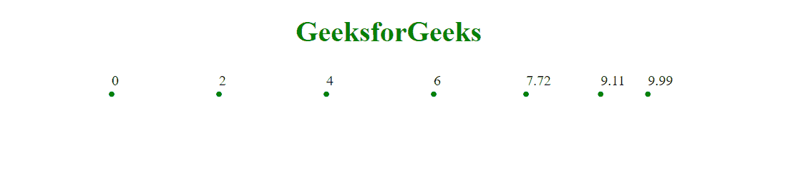

# D3.js scaleLinear()方法

> 原文:[https://www.geeksforgeeks.org/d3-js-scalelinear-method/](https://www.geeksforgeeks.org/d3-js-scalelinear-method/)

**d3.scaleLinear()方法**用于创建一个可视的比例点。这个方法是用来将数据值转换成可视化变量。

**语法:**

```html
d3.scaleLinear();
```

**参数:**该方法不取参数。

**返回值:**该方法返回线性比例函数。

**示例 1:** 绘制比例尺点。

```html
<!DOCTYPE html>
<html>
<meta charset="utf-8">
<head>
  <title>Line in D3.js</title>
</head>
<script src=
"https://cdnjs.cloudflare.com/ajax/libs/d3/4.2.2/d3.min.js">
</script>

<body>
    <h1 style="text-align: center;
               color: green;">
       GeeksforGeeks
    </h1>
  <center>
    <svg width="700" height="40">
    <g class="scal" transform="translate(40, 30)">
    </g>
  </svg>
</center>
  <script>
var points = [ 0, 2, 4, 6, 7.72, 9.11, 9.99 ];

var ScaleGener = d3.scaleLinear()
  .domain([0, 10])
  .range([0, 600]);

d3.select('svg .scal')
    .selectAll('circle')
    .data(points)
    .enter()
    .append('circle')
    .attr('r', 3)
    .attr('fill', "green")
    .attr('cx', function(d) {
        return ScaleGener(d);
    });
</script>
</body>
</html>
```

**输出:**



**例 2:** 为每个点设置文本。

```html
<!DOCTYPE html>
<html>
<meta charset="utf-8">
<head>
  <title>Line in D3.js</title>
</head>
<script src=
"https://cdnjs.cloudflare.com/ajax/libs/d3/4.2.2/d3.min.js">
</script>

<body>
    <h1 style="text-align: center; 
               color: green;">
      GeeksforGeeks
    </h1>
  <center>
    <svg width="700" height="40">
    <g class="scal" transform="translate(40, 30)">
    </g>
  </svg>
</center>
  <script>
var points = [ 0, 2, 4, 6, 7.72, 9.11, 9.99 ];

var ScaleGener = d3.scaleLinear()
  .domain([0, 10])
  .range([0, 600]);

d3.select('svg .scal')
    .selectAll('circle')
    .data(points)
    .enter()
    .append('circle')
    .attr('r', 3)
    .attr('fill', "green")
    .attr('cx', function(d) {
        return ScaleGener(d);
    });

d3.select('svg .scal')
    .selectAll('text')
    .data(points)
    .enter()
    .append('text')
    .attr('x', function(d) {
        return ScaleGener(d);
    })
    .attr('y', -10)
    .text(function(d) {
        return d;
    });

</script>
</body>
</html>
```

**输出:**

