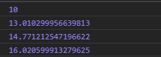
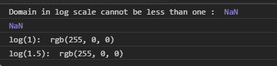

# D3.js scaleLog()函数

> 原文:[https://www.geeksforgeeks.org/d3-js-scalelog-function/](https://www.geeksforgeeks.org/d3-js-scalelog-function/)

**d3.scaleLog()** 功能是用用户自定义的域和范围创建一个新的连续刻度，默认基数为 10。默认情况下，在该比例下，箝位处于禁用状态。

**语法:**

```
d3.scaleLog([[domain, ]range])
```

**参数:**该函数接受两个参数，如上所述，如下所述。

*   **域:**此参数始终接受两个或两个以上的数字。默认值为[1，10]。
*   **范围:**此参数接受数字或字符串数组。它的默认值是[0，1]。

**返回值:**该函数返回新创建的连续刻度。

下面是上面给出的函数的几个例子。

**例 1:**

## 超文本标记语言

```
<!DOCTYPE html>
<html lang="en">

<head>
    <meta charset="UTF-8" />
    <meta name="viewport" path1tent=
    "width=device-width, initial-scale=1.0" />

    <script src="https://d3js.org/d3.v4.min.js">
    </script>
</head>

<body>
    <script>
        var log = d3.scaleLog()
            .domain([1, 10])
            .range([10, 20, 30, 40, 50, 60]);
        console.log(log(1));
        console.log(log(2));
        console.log(log(3));
        console.log(log(4));
    </script>
</body>

</html>
```

**输出:**

[](https://media.geeksforgeeks.org/wp-content/uploads/20200818132808/0121.png)

**例 2:**

## 超文本标记语言

```
<!DOCTYPE html>
<html lang="en">

<head>
    <meta charset="UTF-8" />
    <meta name="viewport" path1tent=
    "width=device-width, initial-scale=1.0" />

    <script src="https://d3js.org/d3.v4.min.js">
    </script>
</head>

<body>
    <script>
        var log = d3.scaleLog()
            .domain([-1, 1])
            .range([10, 20, 30, 40, 50, 60]);

        // Returns NaN as Domain cant be less than one
        console.log("Domain in log scale cannot"
            + " be less than one : ", log(1));

        var log = d3.scaleLog()
            .domain([10, 100])
            .range(["red", "green", "blue", "white"]);
        console.log("log(1): ", log(1));
        console.log("log(1.5): ", log(1.5));
    </script>
</body>

</html>
```

**输出:**

[](https://media.geeksforgeeks.org/wp-content/uploads/20200818133523/0122.png)