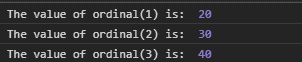
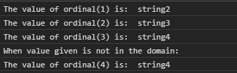

# D3 . jsscale 序数()函数

> 原文:[https://www.geeksforgeeks.org/d3-js-scaleordinal-function/](https://www.geeksforgeeks.org/d3-js-scaleordinal-function/)

**d3.scaleOrdinal()** 函数用于创建并返回具有指定范围和域的序数刻度。如果未给出域和范围，则两者都设置为空数组。这些类型的秤具有离散的区域和范围。

**语法:**

```
d3.scaleOrdinal([[domain, ]range]);

```

**参数:**该函数取两个参数，如上所述，如下所述:

*   **域:**定义刻度的最小值和最大值。
*   **范围:**域中的每个值都映射到该范围内的值。

**返回值:**这个函数不返回任何东西。

**例 1:**

## 超文本标记语言

```
<!DOCTYPE html>
<html lang="en">

<head>
    <meta charset="UTF-8" />
    <meta name="viewport" path1tent=
        "width=device-width, 
        initial-scale=1.0" />
    <script src=
        "https://d3js.org/d3.v4.min.js">
    </script>
</head>

<body>
    <script>

        // Creating the Ordinal scale.
        var ordinal = d3.scaleThreshold()

            // Setting domain for the scale
            .domain([1, 2, 3, 4])
            .range([10, 20, 30, 40]);

        console.log("The value of ordinal(1) is: ",
                ordinal(1));
        console.log("The value of ordinal(2) is: ",
                ordinal(2));
        console.log("The value of ordinal(3) is: ",
                ordinal(3));
    </script>
</body>

</html>
```

**输出:**



**例 2:**

## 超文本标记语言

```
<!DOCTYPE html>
<html lang="en">

<head>
    <meta charset="UTF-8" />
    <meta name="viewport" path1tent=
        "width=device-width, 
        initial-scale=1.0" />

    <script src=
        "https://d3js.org/d3.v4.min.js">
    </script>
</head>

<body>
    <script>
        // Creating the Ordinal scale.
        var ordinal = d3.scaleThreshold()

            // Setting domain for the scale
            .domain([1, 2, 3, 4])
            .range(["String1", "string2", 
                    "string3", "string4"]);

        console.log("The value of ordinal(1) is: ",
                ordinal(1));
        console.log("The value of ordinal(2) is: ",
                ordinal(2));
        console.log("The value of ordinal(3) is: ",
                ordinal(3));
        console.log("When value given is not"
                + " in the domain:")
        console.log("The value of ordinal(4) is: ",
                ordinal(10));
    </script>
</body>

</html>
```

**输出:**

