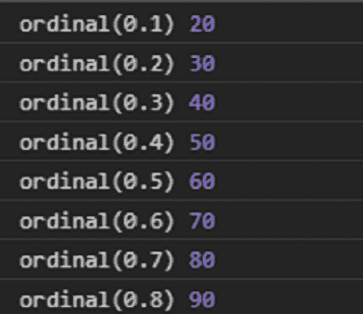
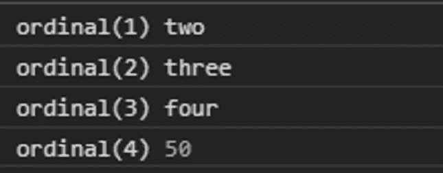

# D3 . jsscale 序数()函数

> 原文:[https://www . geesforgeks . org/D3-js-scale 序数-序数-function/](https://www.geeksforgeeks.org/d3-js-scaleordinal-ordinal-function/)

**d3.js** 库中的**序数()**函数用于在给出对应于指定域的输入时从指定范围返回值。

**语法:**

```
ordinal(value);
```

**参数:**该函数接受一个参数，如上所述，如下所述。

*   **值:**该参数接受来自给定域的值。

**返回值:**该函数从给定输入对应的范围中返回一个值。

下面是上面给出的函数的几个例子。

**例 1:**

## 超文本标记语言

```
<!DOCTYPE html>
<html lang="en">

<head>
    <meta charset="UTF-8" />
    <meta name="viewport" path1tent="width=device-width, 
        initial-scale = 1.0" />

    <script src="https://d3js.org/d3.v4.min.js">
    </script>
</head>

<body>
    <script>
        // Creating the Ordinal scale.
        var ordinal = d3.scaleThreshold()

            // Setting domain for the scale
            .domain([0.1, 0.2, 0.3, 0.4, 0.5, 0.6, 0.7, 0.8])

            // Setting the range for the scale.
            .range([10, 20, 30, 40, 50, 60, 70, 80, 90]);
        console.log("ordinal(0.1)", ordinal(0.1));
        console.log("ordinal(0.2)", ordinal(0.2));
        console.log("ordinal(0.3)", ordinal(0.3));
        console.log("ordinal(0.4)", ordinal(0.4));
        console.log("ordinal(0.5)", ordinal(0.5));
        console.log("ordinal(0.6)", ordinal(0.6));
        console.log("ordinal(0.7)", ordinal(0.7));
        console.log("ordinal(0.8)", ordinal(0.8));
    </script>
</body>

</html>
```

**输出:**



**例 2:**

## 超文本标记语言

```
<!DOCTYPE html>
<html lang="en">

<head>
    <meta charset="UTF-8" />
    <meta name="viewport" path1tent="width=device-width, 
        initial-scale = 1.0" />

    <script src="https://d3js.org/d3.v4.min.js">
    </script>
</head>

<body>
    <script>
        // Creating the Ordinal scale.
        var ordinal = d3.scaleThreshold()

            // Setting domain for the scale
            .domain([1, 2, 3, 4, 5, 6, 7, 8])

            // Setting the range for the scale.
            .range(["one", "two", "three", "four",
                50, 60, 70, 80, 90]);
        console.log("ordinal(1)", ordinal(1));
        console.log("ordinal(2)", ordinal(2));
        console.log("ordinal(3)", ordinal(3));
        console.log("ordinal(4)", ordinal(4));
    </script>
</body>

</html>
```

**输出:**

