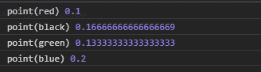
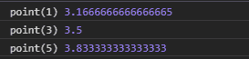

# D3.js scalePoint()函数

> 原文:[https://www.geeksforgeeks.org/d3-js-scalepoint-function/](https://www.geeksforgeeks.org/d3-js-scalepoint-function/)

**d3.scalepoint()** 函数用于创建并返回一个具有特定区域和范围、无舍入、无填充和中心对齐的新点比例。

**语法:**

```
d3.scalePoint([[domain, ]range]);
```

**参数:**该函数取两个参数，如上所述，如下所述:

*   **域:**定义刻度的最小值和最大值。默认情况下，域包含一个空数组。
*   **范围:**域中的每个值都映射到该范围内的值。默认范围是[0，1]。

**返回值:**这个函数不返回任何东西。

**例 1:**

## 超文本标记语言

```
<!DOCTYPE html>
<html lang="en">

<head>
    <meta charset="UTF-8" />
    <meta name="viewport" path1tent=
        "width=device-width, 
        initial-scale = 1.0" />

    <script src=
        "https://d3js.org/d3.v4.min.js">
    </script>
</head>

<body>
    <script>
        // Creating the point scale with
        // specified domain and range.
        var point = d3.scalePoint()

            // Setting domain for the scale
            .domain(["red", "green", "black", "blue"])

            // Setting the range for the scale.
            .range([0.1, 0.2, 0.3, 0.4, 0.5]);

        console.log("point(red)", point("red"));
        console.log("point(black)", point("black"));
        console.log("point(green)", point("green"));
        console.log("point(blue)", point("blue"));
    </script>
</body>

</html>
```

**输出:**



**例 2:**

## 超文本标记语言

```
<!DOCTYPE html>
<html lang="en">

<head>
    <meta charset="UTF-8" />
    <meta name="viewport" path1tent=
        "width=device-width, 
        initial-scale = 1.0" />

    <script src=
        "https://d3js.org/d3.v4.min.js">
    </script>
</head>

<body>
    <script>
        // Creating the point scale with
        // specified domain and range.
        var point = d3.scalePoint()

            // Setting domain for the scale
            .domain([0, 1, 2, 3, 4, 5, 6])

            // Setting the range for the scale.
            .range([3, 4, 0.5]);

        console.log("point(1)", point("1"));
        console.log("point(3)", point("3"));
        console.log("point(5)", point("5"));
    </script>
</body>

</html>
```

**输出:**

