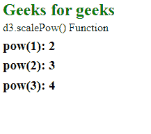
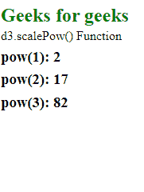

# D3.js scalePow()函数

> 原文:[https://www.geeksforgeeks.org/d3-js-scalepow-function/](https://www.geeksforgeeks.org/d3-js-scalepow-function/)

**d3.scalePow()** 函数用于创建和返回一个新的连续刻度。这个比例有一个特定的领域和范围。一般来说，它作为一个线性标度，但当与指数一起使用时，它以不同的方式工作。

**语法:**

```
d3.scalePow([[domain, ]range]);

```

**参数:**该函数接受两个参数，如上所述，如下所述。

*   **域:**此参数始终接受两个或两个以上的数字。
*   **范围:**此参数接受数字或字符串数组。

**返回值:**这个函数不返回任何东西。

下面的例子说明了 D3.js 中的 scalePow()函数:

**例 1:**

## 超文本标记语言

```
<!DOCTYPE html>
<html lang="en">

<head>
    <meta charset="UTF-8" />
    <meta name="viewport" path1tent=
        "width=device-width,initial-scale=1.0"/>
    <script src="https://d3js.org/d3.v4.min.js">
    </script>
    <script src=
    "https://d3js.org/d3-color.v1.min.js">
    </script>
    <script src=
    "https://d3js.org/d3-interpolate.v1.min.js">
    </script>
    <script src=
    "https://d3js.org/d3-scale-chromatic.v1.min.js">
    </script>
</head>

<body>
    <h2 style="color:green;">Geeks for geeks</h2>

    <p>d3.scalePow() Function </p>

    <script>
        var pow = d3.scalePow()
            .domain([0, 1])
            .range([1, 2, 3, 4, 5, 6]);

        document.write("<h3> pow(1): "
                    + pow(1) + "</h3>");
        document.write("<h3>pow(2): " 
                    + pow(2) + "</h3>");
        document.write("<h3>pow(3): " 
                    + pow(3) + "</h3>");
    </script>
</body>

</html>
```

**输出:**



**例 2:**

## 超文本标记语言

```
<!DOCTYPE html>
<html lang="en">

<head>
    <meta charset="UTF-8" />
    <meta name="viewport" path1tent=
        "width=device-width,initial-scale=1.0"/>
    <script src="https://d3js.org/d3.v4.min.js">
    </script>
    <script src=
    "https://d3js.org/d3-color.v1.min.js">
    </script>
    <script src=
    "https://d3js.org/d3-interpolate.v1.min.js">
    </script>
    <script src=
    "https://d3js.org/d3-scale-chromatic.v1.min.js">
    </script>
</head>

<body>
    <h2 style="color:green;">Geeks for geeks</h2>

    <p>d3.scalePow() Function </p>

    <script>
        var pow = d3.scalePow()
            .domain([0, 1])
            .range([1, 2, 3, 4, 5, 6])
            .exponent(4);

        document.write("<h3> pow(1): "
                    + pow(1) + "</h3>");
        document.write("<h3>pow(2): " 
                    + pow(2) + "</h3>");
        document.write("<h3>pow(3): " 
                    + pow(3) + "</h3>");
    </script>
</body>

</html>
```

**输出:**

