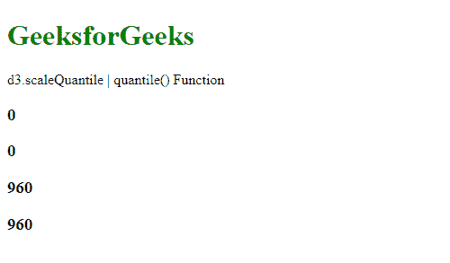

# D3.js scaleQuantile 分位数()函数

> 原文:[https://www . geesforgeks . org/D3-js-scale quantile-quantile-function/](https://www.geeksforgeeks.org/d3-js-scalequantile-quantile-function/)

**D3.js** 中 d3.scaleQuantile()的**分位数()**函数用于从给定输入值对应的范围中返回一个值。该输入值位于指定的域中。

**语法:**

```
quantile( value )
```

**参数:**该函数接受一个参数，如上所述，如下所述:

*   **值:**取域内的数值。

**返回值:**该函数返回与指定范围对应的值。

下面的程序说明了 D3.js 中的**分位数()**函数:

**示例:**

## 超文本标记语言

```
<!DOCTYPE html>
<html>

<head>
    <script src="https://d3js.org/d3.v4.min.js">
    </script>
    <script src="https://d3js.org/d3-color.v1.min.js">
    </script>
    <script src=
    "https://d3js.org/d3-interpolate.v1.min.js">
    </script>
    <script src=
    "https://d3js.org/d3-scale-chromatic.v1.min.js">
    </script>
</head>

<body>
    <h1 style="color: green">GeeksforGeeks</h1>

    <p>d3.scaleQuantile | quantile() Function </p>

    <script>
        var quantile = d3.scaleQuantile()

            // Setting domain and range
            // for the scale
            .domain([1, 10])
            .range([0, 960]);

        // Printing the output using the
        // quantile() function
        document.write(
            "<h3>" + quantile(1) + "</h3>");
        document.write(
            "<h3>" + quantile(5) + "</h3>");
        document.write(
            "<h3>" + quantile(9) + "</h3>");
        document.write(
            "<h3>" + quantile(10) + "</h3>");
    </script>
</body>

</html>
```

**输出:**

