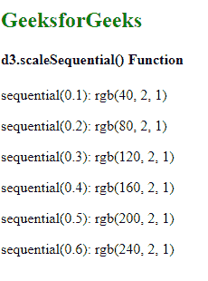
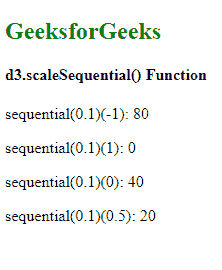

# D3.js scaleSequential()函数

> 原文:[https://www . geeksforgeeks . org/D3-js-scale serial-function/](https://www.geeksforgeeks.org/d3-js-scalesequential-function/)

顺序音阶与连续音阶非常相似。在连续的尺度上，映射在域和范围之间以连续的方式完成。唯一不同的是，该标尺的输出范围由其插值器固定，并且该范围不能改变。

**d3.scaleSequential()** 功能用于创建和返回顺序刻度。这个比例有一个特定的领域和固定的范围。

**语法:**

```
d3.scaleSequential([[domain, ]interpolator]);
```

**参数:**上面给定的函数接受上面提到的和下面描述的两个参数。

*   **域:**这是最大和最小输入值范围。默认域是[0，1]。
*   **插值器:**这需要插值器功能。如果未指定，则默认为标识函数。

**返回值:**该函数返回一个函数。

**例 1:**

## 超文本标记语言

```
<!DOCTYPE html> 
<html lang="en"> 

<head> 
    <meta charset="UTF-8" /> 
    <meta name="viewport"
        path1tent="width=device-width, 
        initial-scale=1.0"/> 

    <script src=
        "https://d3js.org/d3.v4.min.js">
    </script>
</head> 

<body> 
    <h2 style="color:green">GeeksforGeeks</h2>

    <h4>d3.scaleSequential() Function</h4>

    <script> 
        var sequential= d3.scaleSequential(
            function(t) {
                return d3.rgb(t * 400, 1.5, 0.8);
            }
        )

        document.write("<p>sequential(0.1): ",
                sequential(0.1) + "</p>");

        document.write("<p>sequential(0.2): ",
                sequential(0.2) + "</p>");

        document.write("<p>sequential(0.3): ",
                sequential(0.3) + "</p>");

        document.write("<p>sequential(0.4): ",
                sequential(0.4) + "</p>");

        document.write("<p>sequential(0.5): ",
                sequential(0.5) + "</p>");

        document.write("<p>sequential(0.6): ",
                sequential(0.6) + "</p>");
    </script> 
</body> 

</html>
```

**输出:**



**例 2:**

## 超文本标记语言

```
<!DOCTYPE html> 
<html lang="en"> 

<head> 
    <meta charset="UTF-8" /> 
    <meta name="viewport"
        path1tent="width=device-width, 
        initial-scale=1.0"/> 

    <script src=
        "https://d3js.org/d3.v4.min.js">
    </script>
</head> 

<body> 
    <h2 style="color:green">GeeksforGeeks</h2>

    <h4>d3.scaleSequential() Function</h4>

    <script> 
        var sequential= d3.scaleSequential(
            function(t) {
                return d3.interpolateNumber(t * 400, 0, 10);
            }
        )

        document.write("<p>sequential(0.1)(-1): ",
                    sequential(0.1)(-1) + "</p>");

        document.write("<p>sequential(0.1)(1): ",
                    sequential(0.1)(1) + "</p>");

        document.write("<p>sequential(0.1)(0): ",
                    sequential(0.1)(0) + "</p>");

        document.write("<p>sequential(0.1)(0.5): ",
                    sequential(0.1)(0.5) + "</p>");
    </script> 
</body>

</html>
```

**输出:**

