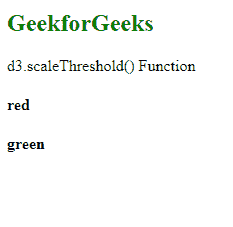
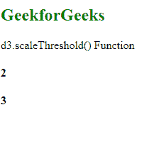

# D3.js scaleThreshold()函数

> 原文:[https://www . geesforgeks . org/D3-js-scale threshold-function/](https://www.geeksforgeeks.org/d3-js-scalethreshold-function/)

**D3.js** 中的 **d3.scaleThreshold()** 功能用于创建并返回一个具有指定域和范围的新阈值比例。域的默认值为[0.5]，范围的默认值为[0，1]。

**语法:**

```
d3.scaleThreshold( domain, range )
```

**参数:**该函数接受两个参数，如上所述，如下所述:

*   **域:**定义刻度的最小值和最大值。这是一个可选参数。默认值为[0.5]。
*   **范围:**它接受一系列离散值，域中的每个值都映射到该范围内的一个值。这是一个可选参数。默认范围是[0，1]。

**返回值:**这个函数不返回任何东西。

下面的程序说明了 D3.js 中的 **d3.scaleThreshold()** 函数:

**例 1:**

## 超文本标记语言

```
<!DOCTYPE html>
<html>

<head>
    <script src="https://d3js.org/d3.v4.min.js">
    </script>
</head>

<body>
    <h2 style="color: green;">GeekforGeeks</h2>

    <p>d3.scaleThreshold() Function </p>

    <script>
        var threshold = d3.scaleThreshold()

            // Setting domain and range for the scale
            .domain([10])
            .range(["red", "green", "black", "blue"]);

        document.write("<h4>" + threshold(9) + "</h4>");
        document.write("<h4>" + threshold(10) + "</h4>");
    </script>
</body>

</html>
```

**输出:**

[](https://media.geeksforgeeks.org/wp-content/uploads/20200822194550/01116.png)

**例 2:**

## 超文本标记语言

```
<!DOCTYPE html>
<html>

<head>
    <script src="https://d3js.org/d3.v4.min.js">
    </script>
</head>

<body>
    <h2 style="color: green;">GeekforGeeks</h2>

    <p>d3.scaleThreshold() Function </p>

    <script>
        var threshold = d3.scaleThreshold()

            // Setting domain and range for the scale
            .domain([1, 2, 10])
            .range([0, 1, 2, 3]);

        document.write("<h4>" + threshold(2) + "</h4>");
        document.write("<h4>" + threshold(10) + "</h4>");
    </script>
</body>

</html>
```

**输出:**

[](https://media.geeksforgeeks.org/wp-content/uploads/20200822194722/01117.png)