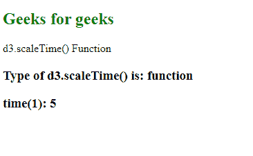
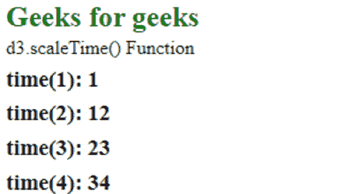

# D3.js scaleTime()函数

> 原文:[https://www.geeksforgeeks.org/d3-js-scaletime-function/](https://www.geeksforgeeks.org/d3-js-scaletime-function/)

**d3.scaleTime()** 函数用于创建和返回具有特定域和范围的新时间刻度。在此功能中，箝位默认被禁用。

**语法:**

```
d3.scaleTime([[domain, ]range]);
```

**参数:**该函数接受两个参数，如上所述，如下所述。

*   **域:**它是定义域值范围的整数数组。如果未指定，则默认值为[2000-01-01，2000-01-02]。
*   **范围:**是整数或字符串的数组。如果未指定，则默认值为[0，1]。

**返回值:**该函数返回一个函数。

**例 1:**

## 超文本标记语言

```
<!DOCTYPE html>
<html lang="en">

<head>
    <meta charset="UTF-8" />
    <meta name="viewport" path1tent=
        "width=device-width,initial-scale=1.0"/>
    <script src="https://d3js.org/d3.v4.min.js">
    </script>
    <script src="https://d3js.org/d3-color.v1.min.js">
    </script>
    <script src=
    "https://d3js.org/d3-interpolate.v1.min.js">
    </script>
    <script src=
    "https://d3js.org/d3-scale-chromatic.v1.min.js">
    </script>
</head>

<body>
    <h2 style="color:green">Geeks for geeks</h2>
    <p>d3.scaleTime() Function</p>
    <script>
        var time = d3.scaleTime()
            .domain([1, 10])
            .range([10, 5]);
        document.write("<h3>Type of d3.scaleTime() is: "
            + typeof (time) + "</h3>");

        document.write("<h3>time(10): " 
            + time(10) + "</h3>");
    </script>
</body>

</html>
```

**输出:**



**例 2:**

## 超文本标记语言

```
<!DOCTYPE html>
<html lang="en">

<head>
    <meta charset="UTF-8" />
    <meta name="viewport" path1tent=
        "width=device-width, initial-scale=1.0"/>
    <script src="https://d3js.org/d3.v4.min.js">
    </script>
    <script src="https://d3js.org/d3-color.v1.min.js">
    </script>
    <script src=
    "https://d3js.org/d3-interpolate.v1.min.js">
    </script>
    <script src=
    "https://d3js.org/d3-scale-chromatic.v1.min.js">
    </script>
</head>

<body>
    <h2 style="color:green;">Geeks for geeks</h2>
    <p>d3.scaleTime() Function </p>
    <script>
        var time = d3.scaleTime()
            .domain([1, 10])
            .range([1, 100])
        document.write("<h3>time(1): " + time(1) + "</h3>")
        document.write("<h3>time(2): " + time(2) + "</h3>")
        document.write("<h3>time(3): " + time(3) + "</h3>")
        document.write("<h3>time(4): " + time(4) + "</h3>")
    </script>
</body>

</html>
```

**输出:**

