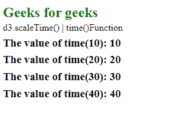

# D3.js scaleTime time()函数

> 原文:[https://www . geesforgeks . org/D3-js-scale time-time-function/](https://www.geeksforgeeks.org/d3-js-scaletime-time-function/)

**d3.scaleTime()** 的 **time()** 功能用于从指定域返回给定范围内的值。

**语法:**

```
time(value)
```

**参数:**该函数只接受一个参数，如上所述，如下所述。

*   **值:**接受来自指定域的值。

**返回值:**该函数从范围中返回一个值。

下面的例子说明了 D3.js 中的 scaleTime time()函数:

**示例:**

## 超文本标记语言

```
<!DOCTYPE html>
<html lang="en">

<head>
    <meta charset="UTF-8" />
    <meta name="viewport" path1tent=
        "width=device-width,initial-scale=1.0"/>
    <script src="https://d3js.org/d3.v4.min.js">
    </script>
    <script src=
    "https://d3js.org/d3-color.v1.min.js">
    </script>
    <script src=
    "https://d3js.org/d3-interpolate.v1.min.js">
    </script>
    <script src=
    "https://d3js.org/d3-scale-chromatic.v1.min.js">
    </script>
</head>

<body>
    <h2 style="color:green;">Geeks for geeks</h2>

    <p>d3.scaleTime() | time() Function </p>

    <script>
        var time = d3.scaleTime()
            .domain([1, 100])
            .range([1, 100])
        document.write("<h3>The value of time(10): "
                    + time(10) + "</h3>")
        document.write("<h3>The value of time(20): "
                    + time(20) + "</h3>")
        document.write("<h3>The value of time(30): " 
                    + time(30) + "</h3>")
        document.write("<h3>The value of time(40): " 
                    + time(40) + "</h3>")
    </script>
</body>

</html>
```

**输出:**

[](https://media.geeksforgeeks.org/wp-content/uploads/20200819111800/0139.png)