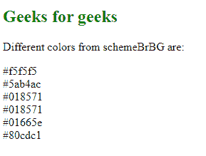
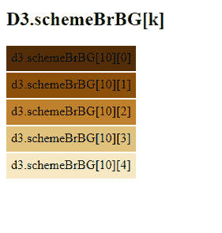

# D3.js schemeBrBG[]功能

> 原文:[https://www.geeksforgeeks.org/d3-js-schemebrbg-function/](https://www.geeksforgeeks.org/d3-js-schemebrbg-function/)

**D3 . scheme BrBG【】**函数是 **d3.js** 中发散配色方案的一部分，用于返回一个 HEX 代码颜色串，该颜色串对应于“BrBG”发散配色方案中的颜色。

**语法:**

```
  d3.schemeBrBG[k];

```

**参数:**该函数接受一个参数，如上所述，如下所述。

*   **k:** 是 3 到 10 范围内的任意数字。

**返回值:**该函数返回一个 HEX 代码颜色字符串。

**例 1:**

## 超文本标记语言

```
<!DOCTYPE html> 
<html lang="en"> 
<head> 
    <meta charset="UTF-8" /> 
    <meta name="viewport"
        path1tent="width=device-width, 
        initial-scale=1.0"/> 
    <title>D3.js schemeBrBG[] Function</title> 
    <script src=
    "https://d3js.org/d3.v4.min.js">
    </script> 
    <script src=
    "https://d3js.org/d3-color.v1.min.js">
    </script> 
    <script src=
    "https://d3js.org/d3-interpolate.v1.min.js">
    </script> 
    <script src=
    "https://d3js.org/d3-scale-chromatic.v1.min.js">
    </script> 

    <style>
        h2{
            color: green;
        }
    </style>
</head> 

<body> 
    <h2>Geeks for geeks</h2>
    <p>Different colors from schemeBrBG are: </p>
    <script> 
        document.write(d3.schemeBrBG[3][1]+"<br>"); 
        document.write(d3.schemeBrBG[3][2]+"<br>"); 
        document.write(d3.schemeBrBG[4][3]+"<br>"); 
        document.write(d3.schemeBrBG[5][4]+"<br>"); 
        document.write(d3.schemeBrBG[6][5]+"<br>"); 
        document.write(d3.schemeBrBG[10][6]); 
    </script> 
</body> 
</html>
```

**输出:**



**例 2:**

## 超文本标记语言

```
<!DOCTYPE html>
<html lang="en">

<head>
    <meta charset="UTF-8">
    <meta name="viewport" content="width=device-width, 
        initial-scale=1.0">

    <!--Fetching from CDN of D3.js -->
    <script src="https://d3js.org/d3.v4.min.js">
    </script>
    <script src="https://d3js.org/d3-color.v1.min.js">
    </script>
    <script src=
        "https://d3js.org/d3-interpolate.v1.min.js">
    </script>
    <script src=
        "https://d3js.org/d3-scale-chromatic.v1.min.js">
    </script>

    <style>
        div {
            padding: 6px;
            text-align: center;
            vertical-align: middle;
            display: flex;
            justify-content: center;
            width: fit-content;
            margin-top: 2px;
            height: 20px;
        }
    </style>
</head>

<body>
    <h2>D3.schemeBrBG[k] </h2>
    <div class="pixel1">
        <span>d3.schemeBrBG[10][0]</span>
    </div>
    <div class="pixel2">
        <span>d3.schemeBrBG[10][1]</span>
    </div>
    <div class="pixel3">
        <span>d3.schemeBrBG[10][2]</span>
    </div>
    <div class="pixel4">
        <span>d3.schemeBrBG[10][3]</span>
    </div>
    <div class="pixel5">
        <span>d3.schemeBrBG[10][4]</span>
    </div>

    <script>
        // Creating different colors for 
        // different value of k
        let color1 =
            d3.schemeBrBG[10][0];
        let color2 =
            d3.schemeBrBG[10][1];
        let color3 =
            d3.schemeBrBG[10][2];
        let color4 =
            d3.schemeBrBG[10][3];
        let color5 =
            d3.schemeBrBG[10][4];

        // Selecting Div using query selector
        let pixel1 = document.querySelector(".pixel1");
        let pixel2 = document.querySelector(".pixel2");
        let pixel3 = document.querySelector(".pixel3");
        let pixel4 = document.querySelector(".pixel4");
        let pixel5 = document.querySelector(".pixel5");

        // Setting style and BG color of
        // the particular DIVs
        pixel1.style.backgroundColor = color1;
        pixel2.style.backgroundColor = color2;
        pixel3.style.backgroundColor = color3;
        pixel4.style.backgroundColor = color4;
        pixel5.style.backgroundColor = color5;
    </script>
</body>

</html>
```

**输出:**

