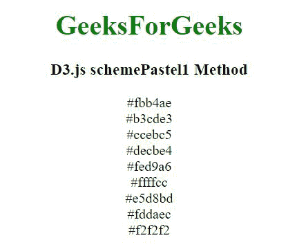
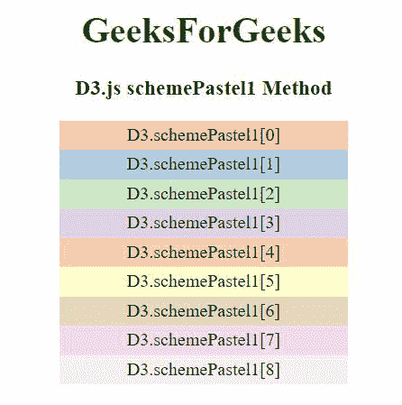

# D3 . js scheme palette 1 方法

> 原文:[https://www.geeksforgeeks.org/d3-js-schemepastel1-method/](https://www.geeksforgeeks.org/d3-js-schemepastel1-method/)

**D3.js** 中的**D3 . scheme palette 1**方法用于返回一个由九种分类颜色组成的数组，该数组以 RGB 十六进制字符串的形式返回。

**语法:**

```
d3.schemePastel1
```

**参数:**此功能不接受任何参数。

**返回值:**返回一个 RGB 十六进制字符串。

**例 1:**

## 超文本标记语言

```
<!DOCTYPE html> 
<html lang="en"> 
<head> 
    <meta charset="UTF-8" /> 
    <meta name="viewport"
        path1tent="width=device-width,  
        initial-scale=1.0"/>       

    <script src= "
        https://d3js.org/d3.v4.min.js">
    </script> 
    <script src= "
        https://d3js.org/d3-color.v1.min.js">
    </script> 
    <script src= "
    https://d3js.org/d3-interpolate.v1.min.js">
    </script> 
    <script src= "
    https://d3js.org/d3-scale-chromatic.v1.min.js">
    </script> 
</head> 

<body> 
    <center>
    <h1 style="color:green;">GeeksForGeeks</h1>

    <h3>D3.js schemePastel1 Method</h3>

    <script> 
        document.write(d3.schemePastel1[0]+"<br>"); 
        document.write(d3.schemePastel1[1]+"<br>");
        document.write(d3.schemePastel1[2]+"<br>");
        document.write(d3.schemePastel1[3]+"<br>");
        document.write(d3.schemePastel1[4]+"<br>");
        document.write(d3.schemePastel1[5]+"<br>");
        document.write(d3.schemePastel1[6]+"<br>");
        document.write(d3.schemePastel1[7]+"<br>");
        document.write(d3.schemePastel1[8]+"<br>");
    </script> 
    </center>
</body> 
</html>
```

**输出:**



**例 2:**

## 超文本标记语言

```
<!DOCTYPE html> 
<html lang="en"> 
<head> 
    <meta charset="UTF-8" /> 
    <meta name="viewport"
        path1tent="width=device-width,  
        initial-scale=1.0"/> 

    <script src="
        https://d3js.org/d3.v4.min.js">
    </script> 
    <script src="
         https://d3js.org/d3-color.v1.min.js">
    </script> 
    <script src="
    https://d3js.org/d3-interpolate.v1.min.js">
    </script> 
    <script src= "
    https://d3js.org/d3-scale-chromatic.v1.min.js">
    </script> 

    <style> 
        div { 
            padding: 3px; 
            width: fit-content; 
            height: 20px;
            width: 250px;
        } 
    </style> 
</head>

<body> 
    <center>
    <h1 style="color:green;">GeeksForGeeks</h1>

    <h3>D3.js schemePastel1 Method</h3>

    <div class="b1"> 
        <span> 
            D3.schemePastel1[0] 
        </span> 
    </div> 
    <div class="b2"> 
        <span> 
            D3.schemePastel1[1]   
        </span> 
    </div> 
    <div class="b3"> 
        <span> 
            D3.schemePastel1[2] 
        </span> 
    </div> 
    <div class="b4"> 
        <span> 
            D3.schemePastel1[3]  
        </span> 
    </div> 
    <div class="b5"> 
        <span> 
            D3.schemePastel1[4] 
        </span> 
    </div> 
    <div class="b6"> 
        <span> 
            D3.schemePastel1[5]  
        </span> 
    </div> 
    <div class="b7"> 
        <span> 
            D3.schemePastel1[6]  
        </span> 
    </div> 
    <div class="b8"> 
        <span> 
            D3.schemePastel1[7] 
        </span> 
    </div> 
    <div class="b9"> 
        <span> 
            D3.schemePastel1[8] 
        </span> 
    </div> 
    <script> 
        // Array of colors is given 
        let color1 = d3.schemePastel1[0]; 
        let color2 = d3.schemePastel1[1]; 
        let color3 = d3.schemePastel1[2]; 
        let color4 = d3.schemePastel1[3]; 
        let color5 = d3.schemePastel1[4]; 
        let color6 = d3.schemePastel1[5];
        let color7 = d3.schemePastel1[6]; 
        let color8 = d3.schemePastel1[7];
        let color9 = d3.schemePastel1[8]; 

        let b1 = document.querySelector(".b1"); 
        let b2 = document.querySelector(".b2"); 
        let b3 = document.querySelector(".b3"); 
        let b4 = document.querySelector(".b4"); 
        let b5 = document.querySelector(".b5"); 
        let b6 = document.querySelector(".b6"); 
        let b7 = document.querySelector(".b7"); 
        let b8 = document.querySelector(".b8");  
        let b9 = document.querySelector(".b9"); 

        b1.style.backgroundColor = color1; 
        b2.style.backgroundColor = color2;
        b3.style.backgroundColor = color3; 
        b4.style.backgroundColor = color4;
        b5.style.backgroundColor = color5; 
        b6.style.backgroundColor = color6;
        b7.style.backgroundColor = color7;
        b8.style.backgroundColor = color8; 
        b9.style.backgroundColor = color9; 

    </script> 
    </center>
</body> 
</html>
```

**输出:**

