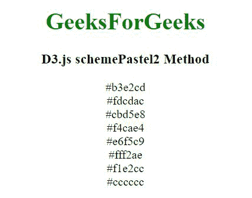
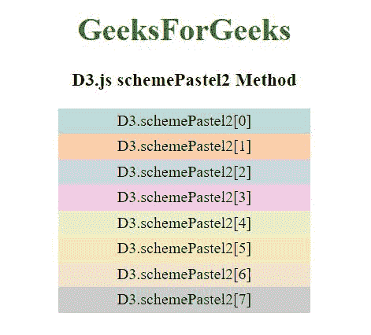

# D3 . js scheme palette 2 方法

> 原文:[https://www.geeksforgeeks.org/d3-js-schemepastel2-method/](https://www.geeksforgeeks.org/d3-js-schemepastel2-method/)

D3.js 中的**D3 . scheme palette 2 方法**用于返回八种分类颜色的数组，该数组以 RGB 十六进制字符串的形式返回。

**语法:**

```
d3.schemePastel2
```

**参数:**此方法不接受任何参数。

**返回值:**返回一个 RGB 十六进制字符串。

**例 1:**

## 超文本标记语言

```
<!DOCTYPE html>
<html>

<head>
    <script src="https://d3js.org/d3.v4.min.js">
    </script>
    <script src=
        "https://d3js.org/d3-color.v1.min.js">
    </script>
    <script src=
        "https://d3js.org/d3-interpolate.v1.min.js">
    </script>
    <script src=
        "https://d3js.org/d3-scale-chromatic.v1.min.js">
    </script>
</head>

<body>
    <center>
        <h1 style="color:green;">GeeksForGeeks</h1>
        <h3>D3.js schemePastel2 Method</h3>

        <script>
            document.write(d3.schemePastel2[0] + "<br>");
            document.write(d3.schemePastel2[1] + "<br>");
            document.write(d3.schemePastel2[2] + "<br>");
            document.write(d3.schemePastel2[3] + "<br>");
            document.write(d3.schemePastel2[4] + "<br>");
            document.write(d3.schemePastel2[5] + "<br>");
            document.write(d3.schemePastel2[6] + "<br>");
            document.write(d3.schemePastel2[7] + "<br>");
        </script>
    </center>
</body>

</html>
```

**输出:**



**例 2:**

## 超文本标记语言

```
<!DOCTYPE html>
<html>

<head>
    <script src="https://d3js.org/d3.v4.min.js">
    </script>
    <script src=
        "https://d3js.org/d3-color.v1.min.js">
    </script>
    <script src=
        "https://d3js.org/d3-interpolate.v1.min.js">
    </script>
    <script src=
        "https://d3js.org/d3-scale-chromatic.v1.min.js">
    </script>

    <style>
        div {
            padding: 3px;
            width: fit-content;
            height: 20px;
            width: 250px;
        }
    </style>
</head>

<body>
  <center>
    <h1 style="color:green;">GeeksForGeeks</h1>
    <h3>D3.js schemePastel2 Method</h3>

    <div class="b1">
      <span>
        D3.schemePastel2[0]
      </span>
    </div>
    <div class="b2">
      <span>
        D3.schemePastel2[1]
      </span>
    </div>
    <div class="b3">
      <span>
        D3.schemePastel2[2]
      </span>
    </div>
    <div class="b4">
      <span>
        D3.schemePastel2[3]
      </span>
    </div>
    <div class="b5">
      <span>
        D3.schemePastel2[4]
      </span>
    </div>
    <div class="b6">
      <span>
        D3.schemePastel2[5]
      </span>
    </div>
    <div class="b7">
      <span>
        D3.schemePastel2[6]
      </span>
    </div>
    <div class="b8">
      <span>
        D3.schemePastel2[7]
      </span>
    </div>
    <script>
      // Array of colors is given 
      let color1 = d3.schemePastel2[0];
      let color2 = d3.schemePastel2[1];
      let color3 = d3.schemePastel2[2];
      let color4 = d3.schemePastel2[3];
      let color5 = d3.schemePastel2[4];
      let color6 = d3.schemePastel2[5];
      let color7 = d3.schemePastel2[6];
      let color8 = d3.schemePastel2[7];

      let b1 = document.querySelector(".b1");
      let b2 = document.querySelector(".b2");
      let b3 = document.querySelector(".b3");
      let b4 = document.querySelector(".b4");
      let b5 = document.querySelector(".b5");
      let b6 = document.querySelector(".b6");
      let b7 = document.querySelector(".b7");
      let b8 = document.querySelector(".b8");

      b1.style.backgroundColor = color1;
      b2.style.backgroundColor = color2;
      b3.style.backgroundColor = color3;
      b4.style.backgroundColor = color4;
      b5.style.backgroundColor = color5;
      b6.style.backgroundColor = color6;
      b7.style.backgroundColor = color7;
      b8.style.backgroundColor = color8;
    </script>
  </center>
</body>
</html>
```

**输出:**

