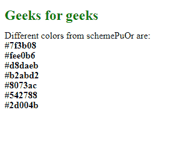
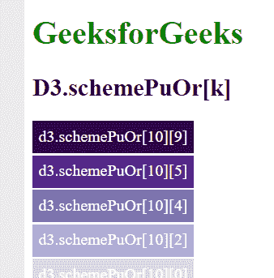

# D3.js schemePuOr[]功能

> 原文:[https://www.geeksforgeeks.org/d3-js-schemepuor-function/](https://www.geeksforgeeks.org/d3-js-schemepuor-function/)

**d3.schemePuOr[]** 函数是 d3.js 中发散配色方案的一部分，用于返回一个 HEX 代码颜色串，该颜色串对应于“PuOr”发散配色方案中的颜色。

**语法:**

```
d3.schemePuOr[k];
```

**参数:**该函数接受如上所述的单个参数，如下所述:

*   **k:** 是 3 到 10 之间的任意数字。

**返回值:**返回颜色的十六进制代码。

下面的例子说明了 D3.js 中的 d3.schemePuOr[]函数:

**例 1:**

## 超文本标记语言

```
<!DOCTYPE html>
<html lang="en">

<head>
    <meta charset="UTF-8" />
    <meta name="viewport" path1tent="width=device-width, 
        initial-scale=1.0" />
    <script src="https://d3js.org/d3.v4.min.js">
    </script>
    <script src="https://d3js.org/d3-color.v1.min.js">
    </script>
    <script src=
    "https://d3js.org/d3-interpolate.v1.min.js">
    </script>
    <script src=
    "https://d3js.org/d3-scale-chromatic.v1.min.js">
    </script>
</head>

<body>
    <h2 style="color:green;">Geeks for geeks</h2>

    <p>Different colors from schemePuOr are: </p>

    <script>
        document.write("<p><b>" 
            + d3.schemePuOr[10][9] + "</p></b>");
        document.write("<p><b>" 
            + d3.schemePuOr[10][5] + "</p></b>");
        document.write("<p><b>" 
            + d3.schemePuOr[10][4] + "</p></b>");
        document.write("<p><b>" 
            + d3.schemePuOr[10][3] + "</p></b>");
        document.write("<p><b>" 
            + d3.schemePuOr[10][2] + "</p></b>");
        document.write("<p><b>" 
            + d3.schemePuOr[10][1] + "</p></b>");
        document.write("<p><b>" 
            + d3.schemePuOr[10][0] + "</p></b>"); 
    </script>
</body>

</html>
```

**输出:**



**例 2:**

## 超文本标记语言

```
<!DOCTYPE html>
<html lang="en">

<head>
    <meta charset="UTF-8">
    <meta name="viewport" content="width=device-width, 
                initial-scale=1.0">
    <!--Fetching from CDN of D3.js -->
    <script src="https://d3js.org/d3.v4.min.js">
    </script>
    <script src="https://d3js.org/d3-color.v1.min.js">
    </script>
    <script src=
    "https://d3js.org/d3-interpolate.v1.min.js">
    </script>
    <script src=

    "https://d3js.org/d3-scale-chromatic.v1.min.js">
    </script>

    <style>
        div {
            padding: 6px;
            color: white;
            text-align: center;
            vertical-align: middle;
            display: flex;
            justify-content: center;
            width: fit-content;
            margin-top: 2px;
            height: 20px;
        }
    </style>
</head>

<body>
    <h1 style="color:green;">GeeksforGeeks</h1>

    <h2>D3.schemePuOr[k] </h2>
    <div class="box1">
        <span>d3.schemePuOr[10][9]</span>
    </div>
    <div class="box2">
        <span>d3.schemePuOr[10][5]</span>
    </div>
    <div class="box3">
        <span>d3.schemePuOr[10][4]</span>
    </div>
    <div class="box4">
        <span>d3.schemePuOr[10][2]</span>
    </div>
    <div class="box5">
        <span>d3.schemePuOr[10][0]</span>
    </div>

    <script>
        // creating different colors 
        // for different value of k
        let color1 =
            d3.schemePuOr[10][0];
        let color2 =
            d3.schemePuOr[10][1];
        let color3 =
            d3.schemePuOr[10][2];
        let color4 =
            d3.schemePuOr[10][3];
        let color5 =
            d3.schemePuOr[10][4];

        // Selecting Div using query selector
        let box1 = document.querySelector(".box1");
        let box2 = document.querySelector(".box2");
        let box3 = document.querySelector(".box3");
        let box4 = document.querySelector(".box4");
        let box5 = document.querySelector(".box5");

        // Setting style and BG color of
        // the particular DIVs
        box1.style.backgroundColor = color1;
        box2.style.backgroundColor = color2;
        box3.style.backgroundColor = color3;
        box4.style.backgroundColor = color4;
        box5.style.backgroundColor = color5;
    </script>
</body>

</html>
```

**输出:**

