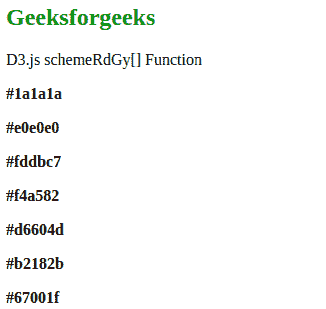
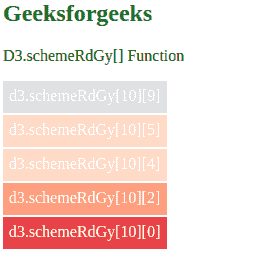

# D3.js schemeRdGy【】功能

> 原文:[https://www.geeksforgeeks.org/d3-js-schemerdgy-function/](https://www.geeksforgeeks.org/d3-js-schemerdgy-function/)

d3.schemeRdGy[]函数用于返回一个 HEX 色码字符串，该字符串对应于 d3.js 中“RdGy”发散配色方案的颜色。

**语法:**

```
d3.schemeRdGy[k];
```

**参数:**该函数接受如上所述的单个参数，如下所述:

*   **k:** 这是一个介于 3 和 10 之间的数字，包括 3 和 10。

**返回值:**该函数返回十六进制数据格式的颜色字符串。

下面的例子说明了 JavaScript 中的 D3.js schemeRdGy[]函数:

**例 1:**

## 超文本标记语言

```
<!DOCTYPE html>
<html lang="en">
<head>
    <meta charset="UTF-8" />
    <meta name="viewport"
          path1tent="width=device-width,
                     initial-scale=1.0"/>
    <script src=
"https://d3js.org/d3.v4.min.js">
    </script>
    <script src=
"https://d3js.org/d3-color.v1.min.js">
    </script>
    <script src=
"https://d3js.org/d3-interpolate.v1.min.js">
    </script>
    <script src=
"https://d3js.org/d3-scale-chromatic.v1.min.js">
    </script>
</head>
<body>
    <h2 style="color: green;">Geeksforgeeks</h2>

<p>D3.js schemeRdGy[] Function</p>

    <script>
        document.write("
<p><b>"
        +d3.schemeRdGy[10][9]+"</p>
</b>");
        document.write("
<p><b>"
        +d3.schemeRdGy[10][5]+"</p>
</b>");
        document.write("
<p><b>"
        +d3.schemeRdGy[10][4]+"</p>
</b>");
        document.write("
<p><b>"
        +d3.schemeRdGy[10][3]+"</p>
</b>");
        document.write("
<p><b>"
        +d3.schemeRdGy[10][2]+"</p>
</b>");
        document.write("
<p><b>"
        +d3.schemeRdGy[10][1]+"</p>
</b>");
        document.write("
<p><b>"
        +d3.schemeRdGy[10][0]+"</p>
</b>");
    </script>
</body>
</html>
```

**输出:**



**例 2:**

## 超文本标记语言

```
<!DOCTYPE html>
<html lang="en">
    <head>
        <meta charset="UTF-8" />
        <meta
            name="viewport"
            content="width=device-width,
                     initial-scale=1.0"/>
    </head>
    <style>
        div {
            padding: 6px;
            color: white;
            text-align: center;
            vertical-align: middle;
            display: flex;
            justify-content: center;
            width: fit-content;
            margin-top: 2px;
            height: 20px;
        }
    </style>
    <body>
        <h2 style="color: green;">
            Geeksforgeeks
        </h2>

<p>D3.schemeRdGy[] Function</p>

        <div class="box1">
            <span>d3.schemeRdGy[10][9]</span>
        </div>
        <div class="box2">
            <span>d3.schemeRdGy[10][5]</span>
        </div>
        <div class="box3">
            <span>d3.schemeRdGy[10][4]</span>
        </div>
        <div class="box4">
            <span>d3.schemeRdGy[10][2]</span>
        </div>
        <div class="box5">
            <span>d3.schemeRdGy[10][0]</span>
        </div>
        <!--Fetching from CDN of D3.js -->
        <script src=
"https://d3js.org/d3.v4.min.js">
        </script>
        <script src=
"https://d3js.org/d3-color.v1.min.js">
        </script>
        <script src=
"https://d3js.org/d3-interpolate.v1.min.js">
        </script>
        <script src=
"https://d3js.org/d3-scale-chromatic.v1.min.js">
        </script>
        <script>
            // Creating different colors for
            // different value of k
            let color1 = d3.schemeRdGy[9][5];
            let color2 = d3.schemeRdGy[10][4];
            let color3 = d3.schemeRdGy[9][3];
            let color4 = d3.schemeRdGy[9][2];
            let color5 = d3.schemeRdGy[9][1];

            // Selecting Div using query selector
            let box1 = document.querySelector(".box1");
            let box2 = document.querySelector(".box2");
            let box3 = document.querySelector(".box3");
            let box4 = document.querySelector(".box4");
            let box5 = document.querySelector(".box5");

            // Setting style and BG color of the
            // particular DIVs
            box1.style.backgroundColor = color1;
            box2.style.backgroundColor = color2;
            box3.style.backgroundColor = color3;
            box4.style.backgroundColor = color4;
            box5.style.backgroundColor = color5;
        </script>
    </body>
</html>
```

**输出:**

