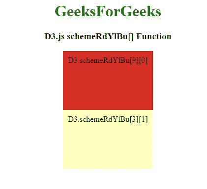

# D3.js schemeRdYlBu[]功能

> 原文:[https://www.geeksforgeeks.org/d3-js-schemerdylbu-function/](https://www.geeksforgeeks.org/d3-js-schemerdylbu-function/)

D3.js 中的 **d3.schemeRdYlBu[]** 函数用于从“RdYlBu”顺序配色方案中返回特定的颜色，该配色方案以十六进制字符串的形式返回。

**语法:**

```
d3.schemeRdYlBu[k]
```

**参数:**该函数接受如上所述的单个参数，如下所述:

*   **k:**“k”是数字。

**返回值:**返回一个十六进制字符串。

以下示例说明了 D3.js: 中的**D3 . scheme rdylbu[]**功能

**例 1:**

## 超文本标记语言

```
<!DOCTYPE html>
<html lang="en">

<head>
    <meta charset="UTF-8" />
    <meta name="viewport" path1tent=
        "width=device-width,initial-scale=1.0" />

    <title>D3.js schemeRdYlBu[] Function</title>

    <script src=
        "https://d3js.org/d3.v4.min.js">
    </script>
    <script src=
        "https://d3js.org/d3-color.v1.min.js">
    </script>
    <script src=
        "https://d3js.org/d3-interpolate.v1.min.js">
    </script>
    <script src=
        "https://d3js.org/d3-scale-chromatic.v1.min.js">
    </script>
</head>

<body>
    <center>
        <h1 style="color:green;">GeeksForGeeks</h1>

        <h3>D3.js schemeRdYlBu[] Function</h3>

        <script>
            document.write(d3.schemeRdYlBu[3][0] + "<br>");
            document.write(d3.schemeRdYlBu[3][1] + "<br>");
            document.write(d3.schemeRdYlBu[3][2] + "<br>");
            document.write(d3.schemeRdYlBu[4][1] + "<br>");
            document.write(d3.schemeRdYlBu[4][2] + "<br>");
            document.write(d3.schemeRdYlBu[4][3]);
        </script>
    </center>
</body>

</html>
```

**输出:**


**例 2:**

## 超文本标记语言

```
<!DOCTYPE html>
<html lang="en">

<head>
    <meta charset="UTF-8" />
    <meta name="viewport" path1tent=
        "width=device-width,initial-scale=1.0" />

    <title>D3.js schemeRdYlBu[] Function</title>
    <script src=
        "https://d3js.org/d3.v4.min.js">
    </script>
    <script src=
        "https://d3js.org/d3-color.v1.min.js">
    </script>
    <script src=
"https://d3js.org/d3-interpolate.v1.min.js">
    </script>
    <script src=
"https://d3js.org/d3-scale-chromatic.v1.min.js">
    </script>
</head>
<style>
    div {
        padding: 10px;
        width: fit-content;
        height: 100px;
    }
</style>

<body>
    <center>
        <h1 style="color:green;">
            GeeksForGeeks
        </h1>

        <h3>D3.js schemeRdYlBu[] Function</h3>

        <div class="b1">
            <span>
                D3.schemeRdYlBu[9][0]
            </span>
        </div>

        <div class="b2">
            <span>
                D3.schemeRdYlBu[3][1]
            </span>
        </div>

        <script>
            // Array of colors is given 
            let color1 = d3.schemeRdYlBu[9][0];

            let color2 = d3.schemeRdYlBu[3][1];

            let b1 = document.querySelector(".b1");
            let b2 = document.querySelector(".b2");
            b1.style.backgroundColor = color1;
            b2.style.backgroundColor = color2; 
        </script>
    </center>
</body>

</html>
```

**输出:**

