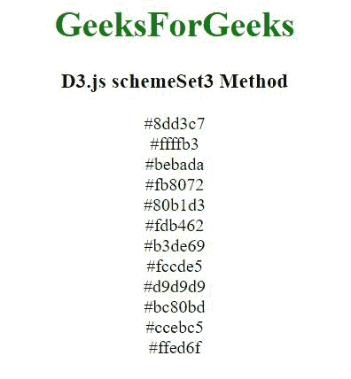
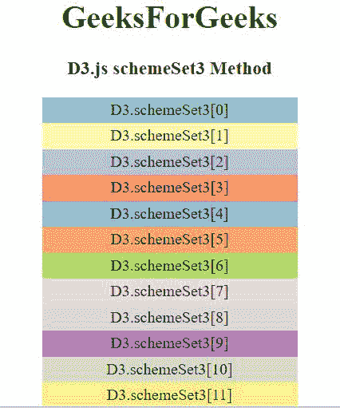

# D3.js schemeSet3 方法

> 原文:[https://www.geeksforgeeks.org/d3-js-schemeset3-method/](https://www.geeksforgeeks.org/d3-js-schemeset3-method/)

D3.js 中的 **d3.schemeSet3 方法**用于返回十二种分类颜色的数组，该数组以 RGB 十六进制字符串的形式返回。

**语法:**

```
d3.schemeSet3
```

**参数:**此方法不接受任何参数。

**返回值:**返回一个 RGB 十六进制字符串。

**例 1:**

## 超文本标记语言

```
<!DOCTYPE html>
<html>

<head>
    <script src="https://d3js.org/d3.v4.min.js">
    </script>
    <script src=
        "https://d3js.org/d3-color.v1.min.js">
    </script>
    <script src=
        "https://d3js.org/d3-interpolate.v1.min.js">
    </script>
    <script src=
    "https://d3js.org/d3-scale-chromatic.v1.min.js">
    </script>
</head>

<body>
    <center>
        <h1 style="color:green;">GeeksForGeeks</h1>

        <h3>D3.js schemeSet3 Method</h3>

        <script>
            document.write(d3.schemeSet3[0] + "<br>");
            document.write(d3.schemeSet3[1] + "<br>");
            document.write(d3.schemeSet3[2] + "<br>");
            document.write(d3.schemeSet3[3] + "<br>");
            document.write(d3.schemeSet3[4] + "<br>");
            document.write(d3.schemeSet3[5] + "<br>");
            document.write(d3.schemeSet3[6] + "<br>");
            document.write(d3.schemeSet3[7] + "<br>");
            document.write(d3.schemeSet3[8] + "<br>");
            document.write(d3.schemeSet3[9] + "<br>");
            document.write(d3.schemeSet3[10] + "<br>");
            document.write(d3.schemeSet3[11] + "<br>");
        </script>
    </center>
</body>

</html>
```

**输出:**



**例 2:**

## 超文本标记语言

```
<!DOCTYPE html>
<html>

<head>
    <script src="https://d3js.org/d3.v4.min.js">
    </script>
    <script src=
        "https://d3js.org/d3-color.v1.min.js">
    </script>
    <script src=
        "https://d3js.org/d3-interpolate.v1.min.js">
    </script>
    <script src=
    "https://d3js.org/d3-scale-chromatic.v1.min.js">
    </script>

    <style> 
        div { 
            padding: 3px; 
            width: fit-content; 
            height: 20px;
            width: 250px;
        } 
    </style> 
</head>

<body> 
  <center>
    <h1 style="color:green;">GeeksForGeeks</h1>

    <h3>D3.js schemeSet3 Method</h3>

    <div class="b1"> 
        <span> 
            D3.schemeSet3[0] 
        </span> 
    </div> 
    <div class="b2"> 
        <span> 
            D3.schemeSet3[1]   
        </span> 
    </div> 
    <div class="b3"> 
        <span> 
            D3.schemeSet3[2] 
        </span> 
    </div> 
    <div class="b4"> 
        <span> 
            D3.schemeSet3[3]  
        </span> 
    </div> 
    <div class="b5"> 
        <span> 
            D3.schemeSet3[4] 
        </span> 
    </div> 
    <div class="b6"> 
        <span> 
            D3.schemeSet3[5]  
        </span> 
    </div> 
    <div class="b7"> 
        <span> 
            D3.schemeSet3[6]  
        </span> 
    </div> 
    <div class="b8"> 
        <span> 
            D3.schemeSet3[7] 
        </span> 
    </div> 
    <div class="b9"> 
        <span> 
            D3.schemeSet3[8] 
        </span> 
    </div> 
    <div class="b10"> 
        <span> 
            D3.schemeSet3[9] 
        </span> 
    </div> 
    <div class="b11"> 
        <span> 
            D3.schemeSet3[10] 
        </span> 
    </div> 
    <div class="b12"> 
        <span> 
            D3.schemeSet3[11] 
        </span> 
    </div> 
    <script> 
        // Array of colors is given 
        let color1 = d3.schemeSet3[0]; 
        let color2 = d3.schemeSet3[1]; 
        let color3 = d3.schemeSet3[2]; 
        let color4 = d3.schemeSet3[3]; 
        let color5 = d3.schemeSet3[4]; 
        let color6 = d3.schemeSet3[5];
        let color7 = d3.schemeSet3[6]; 
        let color8 = d3.schemeSet3[7];  
        let color9 = d3.schemeSet3[8]; 
        let color10 = d3.schemeSet3[9];
        let color11 = d3.schemeSet3[10]; 
        let color12 = d3.schemeSet3[11];  

        let b1 = document.querySelector(".b1"); 
        let b2 = document.querySelector(".b2"); 
        let b3 = document.querySelector(".b3"); 
        let b4 = document.querySelector(".b4"); 
        let b5 = document.querySelector(".b5"); 
        let b6 = document.querySelector(".b6"); 
        let b7 = document.querySelector(".b7"); 
        let b8 = document.querySelector(".b8"); 
        let b9 = document.querySelector(".b9"); 
        let b10 = document.querySelector(".b10"); 
        let b11 = document.querySelector(".b11"); 
        let b12 = document.querySelector(".b12"); 

        b1.style.backgroundColor = color1; 
        b2.style.backgroundColor = color2;
        b3.style.backgroundColor = color3; 
        b4.style.backgroundColor = color4;
        b5.style.backgroundColor = color5; 
        b6.style.backgroundColor = color6;
        b7.style.backgroundColor = color7;
        b8.style.backgroundColor = color8; 
        b9.style.backgroundColor = color9; 
        b10.style.backgroundColor = color10;
        b11.style.backgroundColor = color11;
        b12.style.backgroundColor = color12;
    </script> 
  </center>
</body> 
</html>
```

**输出:**

