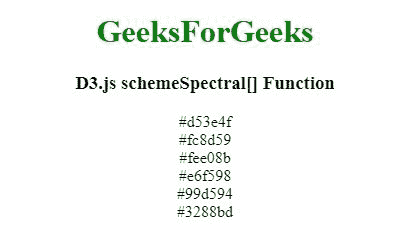

# D3.js schemeSpectral[]函数

> 原文:[https://www . geesforgeks . org/D3-js-scheme spectral-function/](https://www.geeksforgeeks.org/d3-js-schemespectral-function/)

D3.js 中的 **d3.schemeSpectral[]** 函数用于从“Spectral”顺序配色方案中返回特定的颜色，该配色方案以十六进制字符串的形式返回。

**语法:**

```
d3.schemeSpectral[k]
```

**参数:**该函数接受如上所述的单个参数，如下所述:

*   **k:**“k”是数字。

**返回值:**返回一个十六进制字符串。

下面是上面给出的函数的几个例子。

**示例 1:**

```
<!DOCTYPE html> 
<html lang="en"> 
<head> 
    <meta charset="UTF-8" /> 
    <meta name="viewport"
        path1tent="width=device-width,  
        initial-scale=1.0"/> 

    <title>D3.js schemeSpectral[] Function</title> 
    <script src= "https://d3js.org/d3.v4.min.js"></script> 
    <script src= "https://d3js.org/d3-color.v1.min.js"></script> 
    <script src= "https://d3js.org/d3-interpolate.v1.min.js"></script> 
    <script src= "https://d3js.org/d3-scale-chromatic.v1.min.js"></script> 
</head> 
<body> 
    <center>
    <h1 style="color:green;">GeeksForGeeks</h1>

    <h3>D3.js schemeSpectral[] Function</h3>

    <script> 
        document.write(d3.schemeSpectral[6][0]+"<br>"); 
        document.write(d3.schemeSpectral[6][1]+"<br>");
        document.write(d3.schemeSpectral[6][2]+"<br>");
        document.write(d3.schemeSpectral[6][3]+"<br>");
        document.write(d3.schemeSpectral[6][4]+"<br>");
        document.write(d3.schemeSpectral[6][5]);
    </script> 
    </center>
</body> 
</html>
```

**输出:**



**示例 2:**

```
<!DOCTYPE html> 
<html lang="en"> 
<head> 
    <meta charset="UTF-8" /> 
    <meta name="viewport"
        path1tent="width=device-width,  
        initial-scale=1.0"/> 

    <title>D3.js schemeSpectral[] Function</title> 
    <script src= "https://d3js.org/d3.v4.min.js"></script> 
    <script src= "https://d3js.org/d3-color.v1.min.js"></script> 
    <script src= "https://d3js.org/d3-interpolate.v1.min.js"></script> 
    <script src= "https://d3js.org/d3-scale-chromatic.v1.min.js"></script> 
</head> 
<style> 
    div { 
        padding: 10px; 
        width: fit-content; 
        height: 20px; 
    } 
</style> 
<body> 
    <center>
    <h1 style="color:green;">GeeksForGeeks</h1>

    <h3>D3.js schemeSpectral[] Function</h3>

    <div class="b1"> 
        <span> 
            D3.schemeSpectral[6][0] 
        </span> 
    </div> 
    <div class="b2"> 
        <span> 
            D3.schemeSpectral[6][1]  
        </span> 
    </div> 
    <div class="b3"> 
        <span> 
            D3.schemeSpectral[6][2] 
        </span> 
    </div> 
    <div class="b4"> 
        <span> 
            D3.schemeSpectral[6][3]  
        </span> 
    </div> 
    <div class="b5"> 
        <span> 
            D3.schemeSpectral[6][4] 
        </span> 
    </div> 
    <div class="b6"> 
        <span> 
            D3.schemeSpectral[6][5]  
        </span> 
    </div> 

    <script> 
        // Array of colors is given 
        let color1 = d3.schemeSpectral[6][0]; 
        let color2 = d3.schemeSpectral[6][1]; 
        let color3 = d3.schemeSpectral[6][2]; 
        let color4 = d3.schemeSpectral[6][3]; 
        let color5 = d3.schemeSpectral[6][4]; 
        let color6 = d3.schemeSpectral[6][5]; 

        let b1 = document.querySelector(".b1"); 
        let b2 = document.querySelector(".b2"); 
        let b3 = document.querySelector(".b3"); 
        let b4 = document.querySelector(".b4"); 
        let b5 = document.querySelector(".b5"); 
        let b6 = document.querySelector(".b6"); 

        b1.style.backgroundColor = color1; 
        b2.style.backgroundColor = color2;
        b3.style.backgroundColor = color3; 
        b4.style.backgroundColor = color4;
        b5.style.backgroundColor = color5; 
        b6.style.backgroundColor = color6;
    </script> 
    </center>
</body> 
</html>
```

**输出:**

