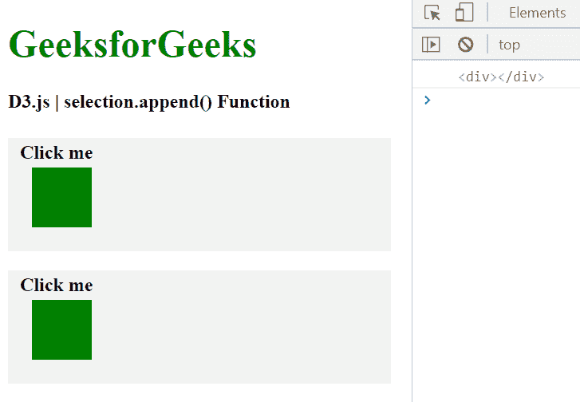
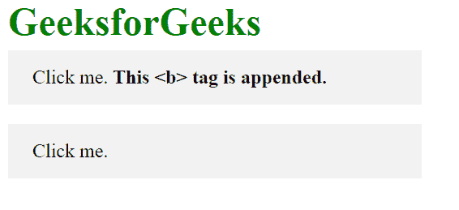

# D3.js 选择.追加()功能

> 原文:[https://www . geesforgeks . org/D3-js-selection-append-function/](https://www.geeksforgeeks.org/d3-js-selection-append-function/)

**selection.append()** 函数用于向元素末尾的参数中给出的 HTML 标记名称追加一个新元素。如果给定的类型是一个函数，那么必须对选择中的每个元素进行求值。

**语法:**

```
 selection.append(type);

```

**参数:**该函数只取一个参数，上面给定，下面描述。

*   **类型:**此参数采用定义元素类型的字符串。

**返回值:**这个函数必须返回一个要追加到末尾的元素。

**示例 1:** 在以下示例中，元素被附加到每个选定的元素。

## 超文本标记语言

```
<!DOCTYPE html>
<html lang="en">

<head>
    <meta charset="UTF-8">
    <meta name="viewport" path1tent="width=device-width, 
            initial-scale=1.0">
    <script src="https://d3js.org/d3.v4.min.js">
    </script>

    <style>
        h1 {
            color: green;
        }

        p {
            background-color: #f2f2f2;
            padding: 10px;
            width: 300px;
            line-height: 5px;
        }

        p:hover {
            background-color: grey;
            padding: 10px;
            cursor: pointer;
        }

        div {
            width: 50px;
            height: 50px;
            background-color: green;
            margin: 10px;
        }
    </style>
</head>

<body>
    <h1>GeeksforGeeks</h1>
    <h4>D3.js | selection.append() Function</h4>

    <p><b>Click me</b></p>
    <p><b>Click me</b></p>

    <script>
        function func() {
            // Selecting all p and
            // Appending a DIV to each p tag
            var chk = d3.selectAll("p")
                .append("div");
            var div = document.querySelector("div");
            console.log(div)
        }
        let btn = document.querySelector("p");
        btn.addEventListener("click", func);
    </script>
</body>

</html>
```

**输出:**

*   **点击“点击我”元素前:**

    

*   **点击“点击我”元素后:**

    

**示例 2:** 在以下示例中，元素仅附加到第一个元素。

## 超文本标记语言

```
<!DOCTYPE html> 
<html lang="en"> 
<head> 
    <meta charset="UTF-8"> 
    <meta name="viewport"
            path1tent="width=device-width, 
                    initial-scale=1.0">   
</head> 
<style>
    h1{
        line-height: 5px;
        color: green;
    }
    h1, h2, p, h4, h5, h6{
        background-color: #f2f2f2;
        padding:20px;
        width: 300px;
        line-height: 5px;
    }
    p:hover{
        background-color: grey;
        cursor: pointer;
    }
    div{
        width: 50px;
        height: 50px;
        background-color: green;
        margin:10px;
    }
</style> 
<body>  
    <h1>Geeks for geeks</h1>
    <p>Click me.</p>
    <p>Click me.</p>
  <script src = 
"https://d3js.org/d3.v4.min.js"> 
  </script>
  <script> 
  function func(){
            // Selecting  p and
            // Appending a DIV to the p tag
            // Only first p tag is effected
            var chk = d3.select("p")
                        .append("b");
            var b=document.querySelector("b");
            b.innerText=" This <b> tag is appended."
        }
    let btn=document.querySelector("p");
    btn.addEventListener("click", func);

  </script> 
</body> 
</html>
```

**输出:**

*   **点击“点击我”按钮前:**

    

*   **点击“点击我”按钮后:**

    