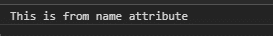
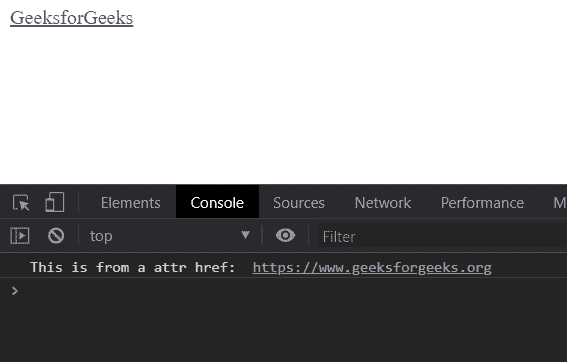

# D3.js 选择. attr()功能

> 原文:[https://www . geesforgeks . org/D3-js-selection-attr-function/](https://www.geeksforgeeks.org/d3-js-selection-attr-function/)

**selection.attr()** 功能用于设置所选元素的属性。属性的名称和属性值将使用该函数进行设置。

**语法:**

```
selection.attr(name[, value]);

```

**参数:**该函数取两个参数，如上图所示，描述如下:

*   **名称:**是属性的名称。
*   **值:**是属性的值。

**返回值:**该函数不返回值。

**例 1:**

## 超文本标记语言

```
<!DOCTYPE html>
<html lang="en">

<head>
    <meta charset="UTF-8">
    <meta name="viewport" path1tent=
        "width=device-width,initial-scale=1.0">

    <title>D3.js selection.attr() Function</title>

    <script src=
        "https://d3js.org/d3.v4.min.js">
    </script>

    <style>
        p {
            line-height: 5px;
        }
    </style>
</head>

<body>
    <div>
        <p>GeeksforGeeks</p>
    </div>

    <script>
        var div = d3.select("p")
            .attr("name", "This is from name attribute");
        var divselect = document.querySelector("p");
        console.log(divselect.getAttribute("name"));
    </script>
</body>

</html>
```

**输出:**



**例 2:**

## 超文本标记语言

```
<!DOCTYPE html>
<html lang="en">

<head>
    <meta charset="UTF-8">
    <meta name="viewport" path1tent=
        "width=device-width,initial-scale=1.0">

    <title>D3.js selection.attr() Function</title>

    <script src=
        "https://d3js.org/d3.v4.min.js">
    </script>

    <style>
        p {
            line-height: 5px;
        }
    </style>
</head>

<body>
    <div>
        <a>GeeksforGeeks</a>
    </div>

    <script>
        var a = d3.select("a").attr("href", 
            "https://www.geeksforgeeks.org");

        var divselect = document.querySelector("a");

        console.log("This is from a attr href: ", 
                divselect.getAttribute("href"));
    </script>
</body>

</html>
```

**输出:**

