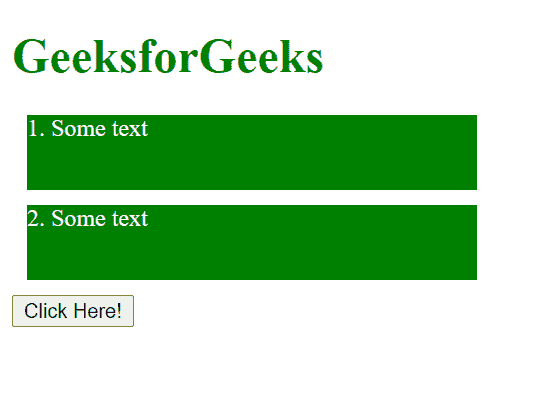
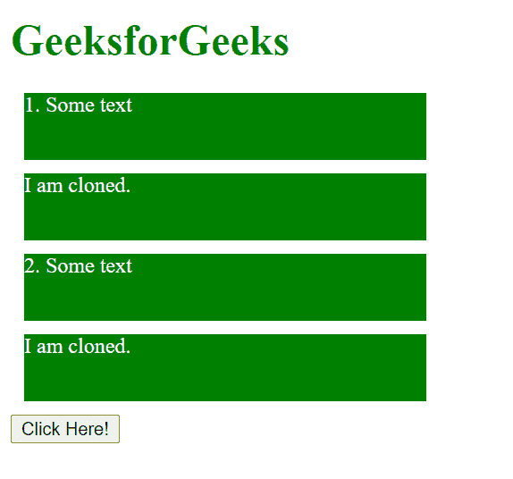
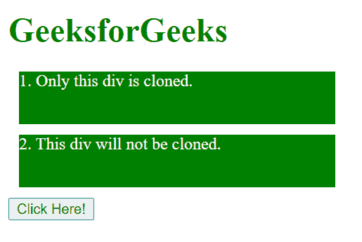
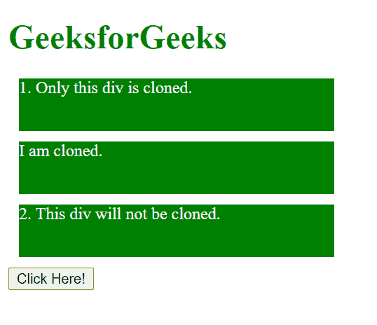
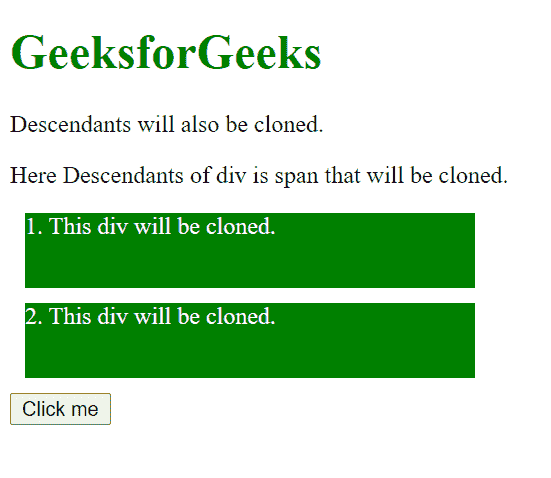
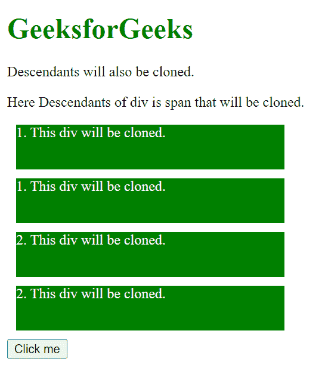

# D3.js 选择.克隆()功能

> 原文:[https://www . geesforgeks . org/D3-js-selection-clone-function/](https://www.geeksforgeeks.org/d3-js-selection-clone-function/)

**selection.clone()** 函数用于克隆选定的元素，并将这些克隆直接插入到相同的元素之后。

**语法:**

```
selection.clone([deep]);
```

**参数:**该功能接受如上所述的单个参数，如下所述:

*   **deep:** 如果 deep 为真，后代节点也将被克隆。

**返回值:**此函数返回要插入的元素的克隆。

下面的例子说明了 D3.js 中的 selection.clone()函数:

**示例 1:** 当选择中所有 div 都生效时。

## 超文本标记语言

```
<!DOCTYPE html>
<html lang="en">

<head>
    <meta charset="UTF-8">
    <meta name="viewport" path1tent="width=device-width, 
                    initial-scale=1.0">
    <script src="https://d3js.org/d3.v4.min.js">
    </script>

    <style>
        h1 {
            color: green;
        }

        p:hover {
            background-color: grey;
            cursor: pointer;
        }

        div {
            width: 300px;
            color: #ffffff;
            height: 50px;
            background-color: green;
            margin: 10px;
        }
    </style>
</head>

<body>
    <h1>GeeksforGeeks</h1>
    <div><span>1\. Some text</span></div>
    <div><span>2\. Some text</span></div>

    <button>Click Here!</button>

    <script>
        function func() {
            // Selecting div and
            // Cloning the div and
            // Adding html to it
            var div = d3.selectAll("div")
                .clone()
                .html("<span>I am cloned.</span>");
            console.log(div);

            var b = document.querySelector("b");
            b.innerText = "This <b> tag is appended. "
        }
        let btn = document.querySelector("button");
        btn.addEventListener("click", func);
    </script>
</body>

</html>
```

**输出:**

*   **点击按钮前:**

    

*   **点击按钮后:**

    

**示例 2:** 当在选择中仅实现一个 div 时。

## 超文本标记语言

```
<!DOCTYPE html>
<html lang="en">

<head>
    <meta charset="UTF-8">
    <meta name="viewport" path1tent="width=device-width, 
                    initial-scale=1.0">
    <script src="https://d3js.org/d3.v4.min.js">
    </script>
    <style>
        h1 {
            color: green;
        }

        p:hover {
            background-color: grey;
            cursor: pointer;
        }

        div {
            width: 300px;
            color: #ffffff;
            height: 50px;
            background-color: green;
            margin: 10px;
        }
    </style>

<body>
    <h1>GeeksforGeeks</h1>
    <div><span>
        1\. Only this div is cloned.
    </span></div>
    <div><span>
        2\. This div will not be cloned.
    </span></div>

    <button>Click Here!</button>

    <script>
        function func() {
            // Selecting div and
            // Cloning the divs
            // Adding html to cloned divs

            var div = d3.select("div")
                .clone()
                .html("<span>I am cloned.</span>");
            console.log(div);
            var b = document.querySelector("b");
            b.innerText = "This <b> tag is appended. "
        }
        let btn = document.querySelector("button");
        btn.addEventListener("click", func);

    </script>
</body>

</html>
```

**输出:**

*   **点击按钮前:**

    

*   **点击按钮后:**

    

**示例 3:** 当 deep 等于 true 时，则克隆所有后代元素。

## 超文本标记语言

```
<!DOCTYPE html>
<html lang="en">

<head>
    <meta charset="UTF-8">
    <meta name="viewport" path1tent="width=device-width, 
                    initial-scale=1.0">
    <script src="https://d3js.org/d3.v4.min.js">
    </script>

    <style>
        h1 {
            color: green;
        }

        div {
            width: 300px;
            color: #ffffff;
            height: 50px;
            background-color: green;
            margin: 10px;
        }
    </style>
</head>

<body>
    <h1>GeeksforGeeks</h1>

    <p>Descendants will also be cloned.</p>

    <p>
        Here Descendants of div is span
        that will be cloned.
    </p>

    <div><span>1\. This div will be cloned.</span></div>
    <div><span>2\. This div will be cloned.</span></div>
    <button>Click me</button>

    <script>
        function func() {

            // Selecting div and Cloning the divs
            // and its descendant elements
            var div = d3.selectAll("div")
                .clone([true])
            console.log(div);
            var b = document.querySelector("b");
            b.innerText = "This <b> tag is appended. "
        }
        let btn = document.querySelector("button");
        btn.addEventListener("click", func);
    </script>
</body>

</html>
```

**输出:**

*   **点击按钮前:**

    

*   **点击按钮后:**

    