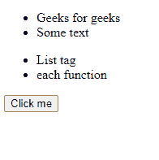
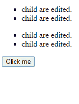
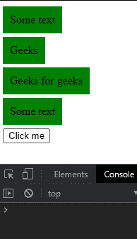
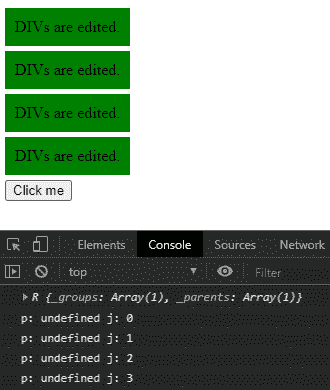

# D3.js 选择.每个()功能

> 原文:[https://www . geesforgeks . org/D3-js-selection-各-function/](https://www.geeksforgeeks.org/d3-js-selection-each-function/)

D3.js 中的 **selection.each()** 函数用于为每个选中的 HTML 元素调用特定的函数。在函数中，数据(d)和索引(I)作为参数给出。通过使用这种方法，可以同时访问父数据和子数据。

**语法:**

```
selection.each(callback);

```

**参数:**该函数接受一个参数，如上所述，如下所述。

*   **回调:**这是每个选中元素调用的函数。

**返回值:**这个函数不返回任何东西。

下面是上面给出的函数的几个例子。

**示例 1:**

## 超文本标记语言

```
<!DOCTYPE html>
<html lang="en">
    <head>
        <meta charset="UTF-8" />
        <meta
            name="viewport"
            path1tent="width=device-width, 
                       initial-scale=1.0"/>
        <title>  D3.js selection.each() Function</title>
    </head>
    <style>
        .div {
            width: 200px;
            height: 200px;
            background-color: green;
            overflow: hidden;
        }
        div {
            background-color: red;
            width: 10px;
            height: 10px;
        }
    </style>
    <body>
        <ul>
            <li>Geeks for geeks</li>
            <li>Some text</li>
        </ul>
        <ul>
            <li>List tag</li>
            <li>each function</li>
        </ul>
        <button>Click me</button>
        <script src=
"https://d3js.org/d3.v4.min.js">
        </script>
        <script src=
"https://d3js.org/d3-selection.v1.min.js">
        </script>
        <script>
            let btn = document.querySelector("button");
            let func = () => {
                let p = d3.selectAll("ul");
                p.each(function (p, j) {
                    d3.select(this)
                        .selectAll("li")
                        .text(function (d, i) {
                            return "child are edited.";
                        });
                });
            };
            btn.addEventListener("click", func);
        </script>
    </body>
</html>
```

**输出:**

**点击按钮前:**



**点击按钮后:**



**例 2:**

## 超文本标记语言

```
<!DOCTYPE html>
<html lang="en">
    <head>
        <meta charset="UTF-8" />
        <meta
            name="viewport"
            path1tent="width=device-width, 
                       initial-scale=1.0"/>
        <title>D3.js selection.each() Function</title>
    </head>
    <style>
        div {
            background-color: green;
            margin-bottom: 5px;
            padding: 10px;
            width: fit-content;
        }
    </style>
    <body>
        <div>Some text</div>
        <div>Geeks</div>
        <div>Geeks for geeks</div>
        <div>Some text</div>
        <button>Click me</button>
        <script src=
"https://d3js.org/d3.v4.min.js">
        </script>
        <script src=
"https://d3js.org/d3-selection.v1.min.js">
        </script>
        <script>
            let btn = document.querySelector("button");
            let func = () => {
                let p = d3.selectAll("div");
                console.log(p);
                p.each(function (p, j) {
                    console.log("p: " + p, "j: " + j);
                    d3.select(this).text(function (d, i) {
                        return "DIVs are edited.";
                    });
                });
            };
            btn.addEventListener("click", func);
        </script>
    </body>
</html>
```

**输出:**

**点击按钮前:**



**点击按钮后:**

