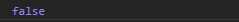
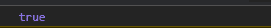

# D3.js 选择.空()功能

> 原文:[https://www . geesforgeks . org/D3-js-selection-empty-function/](https://www.geeksforgeeks.org/d3-js-selection-empty-function/)

D3.js 中的 **d3.empty()** 函数用来返回一个布尔值。当所选内容不包含元素时，该值为真；当所选内容不为空时，该值返回假。

**语法:**

```
selection.empty();
```

**参数:**该函数不取参数。

**返回值:**该函数返回一个布尔值。

下面是上面给出的函数的几个例子。

**例 1:**

```
<!DOCTYPE html> 
<html lang="en"> 
<head> 
    <meta charset="UTF-8"> 
    <meta name="viewport"
            path1tent="width=device-width, 
                    initial-scale=1.0"> 
    <title>Document</title> 
</head> 
<style> 
div{
    background-color: green;
    margin-bottom: 5px;
    padding: 10px;
    width: fit-content;
}
</style> 
<body>  
    <div>Some text</div>
    <div>Geeks for geeks</div>
    <div>Geeks for geeks</div>
    <div>Some text</div>
  <script src = 
"https://d3js.org/d3.v4.min.js"> 
  </script>
  <script src=
  "https://d3js.org/d3-selection.v1.min.js">
</script>
  <script>
      let selection=d3.selectAll("div")
      console.log(selection.empty())
  </script> 
</body> 
</html>
```

**输出:**



**例 2:**

```
<!DOCTYPE html> 
<html lang="en"> 
<head> 
    <meta charset="UTF-8"> 
    <meta name="viewport"
            path1tent="width=device-width, 
                    initial-scale=1.0"> 
    <title>Document</title> 
</head> 
<style> 
div{
    background-color: green;
    margin-bottom: 5px;
    padding: 10px;
    width: fit-content;
}
</style> 
<body>  
    <div>Some text</div>
    <div>Geeks for geeks</div>
    <div>Geeks for geeks</div>
    <div>Some text</div>
  <script src = 
"https://d3js.org/d3.v4.min.js"> 
  </script>
  <script src=
  "https://d3js.org/d3-selection.v1.min.js">
</script>
  <script>
    // Selection is empty because no
    // container name h2 is rendered.
      let selection=d3.selectAll("h2")
      console.log(selection.empty())
  </script> 
</body> 
</html>
```

**输出:**

