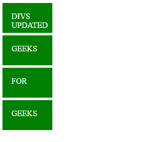
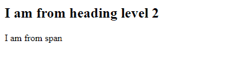
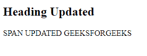

# D3.js 选择.退出()功能

> 原文:[https://www . geesforgeks . org/D3-js-selection-exit-function/](https://www.geeksforgeeks.org/d3-js-selection-exit-function/)

D3.js 中的 **d3.selection.exit()** 函数用于移除对应于旧数据的元素或标签，或者简单地说，这用于用给定的新数据更新之前创建的 DIV 元素。

**语法:**

```
selection.exit();

```

**参数:**此功能不接受任何参数。

**返回值:**该功能返回退出选择。

下面的例子说明了 JavaScript 中的 D3.js selection.exit()函数:

**示例 1:**

## 超文本标记语言

```
<!DOCTYPE html>
<html lang="en">
    <head>
        <meta charset="UTF-8" />
        <meta
            name="viewport"
            path1tent="width=device-width, 
                       initial-scale=1.0"/>
        <title>D3.js selection.exit() Function</title>
    </head>
    <style>
        div {
            background-color: green;
            color: #ffffff;
            width: 100px;
            margin-bottom: 5px;
            padding: 18px;
            box-sizing: border-box;
            height: 60px;
        }
    </style>
    <body>
        <!-- Please note that no div tags are added here -->
        <script src=
"https://d3js.org/d3.v4.min.js">
        </script>
        <script src=
"https://d3js.org/d3-selection.v1.min.js">
        </script>
        <script>

            // This will create DIVs having data as given
            var div = d3
                .select("body")
                .selectAll("div")
                .data(["geeks", "for", "geeks"])
                // Old dataset
                .enter()
                .append("div")
                .text(function (d) {
                    return d;
                });

            div = div.data(["DIVS UPDATED", "GEEKS", 
                            "FOR", "GEEKS"], function (d) {
                return d;
            }); //Updated new data set.
            div.enter()
                .append("div")
                .text(function (d) {
                    return d;
                });
            div.exit().remove();
        </script>
    </body>
</html>
```

**输出:**



**例 2:**

## 超文本标记语言

```
<!DOCTYPE html>
<html lang="en">
    <head>
        <meta charset="UTF-8" />
        <meta
            name="viewport"
            path1tent="width=device-width, 
                       initial-scale=1.0"/>
        <title>D3.js selection.exit() Function</title>
    </head>
    <style>
        div {
            background-color: green;
            color: #ffffff;
            width: 50px;
            margin-bottom: 5px;
            padding: 20px;
            height: 10px;
        }
    </style>
    <body>
        <!-- Please note that no div tags are added here -->
        <script src=
"https://d3js.org/d3.v4.min.js">
        </script>
        <script src=
"https://d3js.org/d3-selection.v1.min.js">
        </script>
        <script>
            var h2 = d3
                .select("body")
                .selectAll("h2")
                .data(["I am from heading level 2"])
                .enter()
                .append("h2")
                .text((d) => {
                    return d;
                });

            // Updated heading
            h2 = h2.data(["Heading Updated"], function (d) {
                return d;
            });
            //Updated new data set.
            h2.enter()
                .append("h2")
                .text(function (d) {
                    return d;
                });
            h2.exit().remove();

            var span = d3
                .select("body")
                .selectAll("span")
                .data("I am from span")
                .enter()
                .append("span")
                .text((d) => {
                    return d;
                });

            // Updated span
            span = span.data(["SPAN UPDATED ", "GEEKS", 
                              "FOR", "GEEKS"], function (d) {
                return d;
            }); //Updated new data set.
            span.enter()
                .append("span")
                .text(function (d) {
                    return d;
                });
            span.exit().remove();
        </script>
    </body>
</html>
```

**输出:**

**使用 exit()功能前:**



**使用退出()功能后:**

