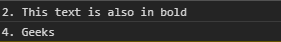
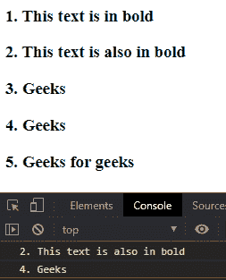

# D3.js 选择.过滤器()功能

> 原文:[https://www . geesforgeks . org/D3-js-selection-filter-function/](https://www.geeksforgeeks.org/d3-js-selection-filter-function/)

d3.js 中的 **d3.selection.filter()** 函数用于过滤给定的选择，并返回一个新的选择，该选择的过滤器为真。要使用的过滤器可以是字符串或函数。

**语法:**

```
selection.filter(filter);
```

**参数:**该函数接受一个参数，如上所述，如下所述:

*   **过滤器:**它是用于过滤选择的字符串或函数。使用函数时，过滤器会应用于每个选定的元素。

**返回值:**该函数返回新的选择。

**示例 1:** 本示例选择指定元素的所有奇数子元素。

## 超文本标记语言

```
<!DOCTYPE html>
<html lang="en">

<head>
    <meta charset="UTF-8">
    <meta name="viewport" content=
        "width=device-width,initial-scale=1.0">

    <script src=
        "https://d3js.org/d3.v4.min.js">
    </script>
    <script src=
        "https://d3js.org/d3-selection.v1.min.js">
    </script>
</head>

<body>
    <div>
        <b>1\. This text is in bold</b>
        <b>2\. This text is also in bold</b>
        <b>3\. Geeks for geeks</b>
        <b>4\. Geeks for geeks</b>
        <b>5\. Geeks for geeks</b>
    </div>

    <script>
        let selection = d3.selectAll("b")
            .filter(":nth-child(odd)")
            .nodes();
        selection.forEach((e) => {
            console.log(e.textContent)
        })
    </script>
</body>

</html>
```

**输出:**


**示例 2:** 本示例选择指定元素的所有偶数子元素。

## 超文本标记语言

```
<!DOCTYPE html>
<html lang="en">

<head>
    <meta charset="UTF-8">
    <meta name="viewport" content=
        "width=device-width,initial-scale=1.0">
    <script src=
        "https://d3js.org/d3.v4.min.js">
    </script>
    <script src=
        "https://d3js.org/d3-selection.v1.min.js">
    </script>
</head>

<body>
    <div>
        <b>1\. This text is in bold</b>
        <b>2\. This text is also in bold</b>
        <b>3\. Geeks</b>
        <b>4\. Geeks</b>
        <b>5\. Geeks for geeks</b>
    </div>

    <script>
        let selection = d3.selectAll("b")
            .filter(":nth-child(even)")
            .nodes();
        selection.forEach((e) => {
            console.log(e.textContent)
        })
    </script>
</body>

</html>
```

**输出:**



**示例 3:** 本示例使用选择。选择全部作为过滤器。

## 超文本标记语言

```
<!DOCTYPE html>
<html>

<head>
    <meta charset="UTF-8">
    <meta name="viewport" content=
        "width=device-width, initial-scale=1.0">

    <script src=
        "https://d3js.org/d3.v4.min.js">
    </script>
    <script src=
        "https://d3js.org/d3-selection.v1.min.js">
    </script>
</head>

<body>
    <div>
        <h3>1\. This text is in bold</h3>
        <h3>2\. This text is also in bold</h3>
        <h3>3\. Geeks</h3>
        <h3>4\. Geeks</h3>
        <h3>5\. Geeks for geeks</h3>
    </div>

    <script>

        // Using selection.selectAll with filter
        let selection = d3.selectAll("div")
            .selectAll("h3")
            .filter(":nth-child(even)")
            .nodes();
        selection.forEach((e) => {
            console.log(e.textContent)
        })
    </script>
</body>

</html>
```

**输出:**

