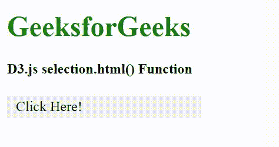
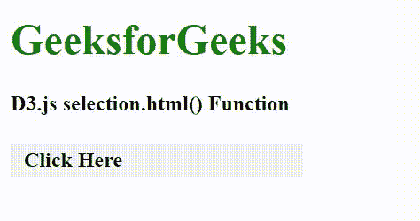

# D3.js selection.html()函数

> 原文:[https://www . geesforgeks . org/D3-js-selection-html-function/](https://www.geeksforgeeks.org/d3-js-selection-html-function/)

**selection.html()** 功能用于设置所有选中元素的内部 html。如果这个值是常数，那么所有的元素都被赋予相同的值。空值将清除元素的内容。

**语法:**

```
selection.html([value]);
```

**参数:**该功能接受如上所述的单个参数，描述如下:

*   **值:**它是将 HTML 设置为文档的字符串类型。

**返回值:**这个函数不返回任何东西。

**示例 1:** 在下面的代码中，HTML“p”元素内容被更改为“粗体”文本。

## 超文本标记语言

```
<!DOCTYPE html>
<html lang="en">

<head>
    <meta charset="UTF-8">
    <meta name="viewport" path1tent=
        "width=device-width, initial-scale=1.0">

    <script src="https://d3js.org/d3.v4.min.js">
    </script>

    <style>
        p {
            background-color: #f2f2f2;
            padding: 10px;
            width: 200px;
            line-height: 5px;
        }

        p:hover {
            background-color: grey;
            padding: 10px;
            cursor: pointer;
        }
    </style>
</head>

<body>
    <div>
        <h1 style="color:green;">
            GeeksforGeeks
        </h1>

        <h4>D3.js selection.html() Function</h4>

        <p>Click Here!</p>
    </div>

    <script>
        function func() {

            // Selecting all p and setting
            // the innerHTML of the p
            var chk = d3.selectAll("p")
                .html("<b>This is from .html</b>");
            var text = document.querySelector("p");
        }
        let btn = document.querySelector("p");
        btn.addEventListener("click", func);
    </script>
</body>

</html>
```

**输出:**



**示例 2:** 以下示例使用 null 清除内容。

## 超文本标记语言

```
<!DOCTYPE html>
<html lang="en">

<head>
    <meta charset="UTF-8">
    <meta name="viewport" path1tent=
        "width=device-width,initial-scale=1.0">

    <script src="https://d3js.org/d3.v4.min.js">
    </script>
    <style>
        p {
            background-color: #f2f2f2;
            padding: 10px;
            width: 200px;
            line-height: 5px;
        }

        p:hover {
            background-color: grey;
            padding: 10px;
            cursor: pointer;
        }
    </style>
</head>

<body>
    <div>
        <h1 style="color:green;">
            GeeksforGeeks
        </h1>

        <h4>D3.js selection.html() Function</h4>

        <p><b>Click Here</b></p>
    </div>

    <script>
        function func() {

            // Selecting p and setting the
            // innerHTML of the p
            var chk = d3.selectAll("p")
                .html(null);
            var text = document.querySelector("p");
        }
        let btn = document.querySelector("p");
        btn.addEventListener("click", func);
    </script>
</body>

</html>
```

**输出:**

