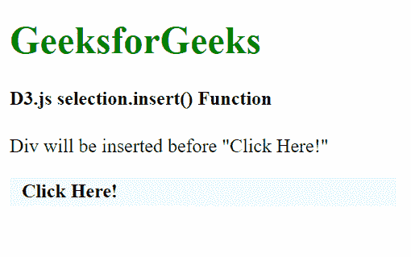
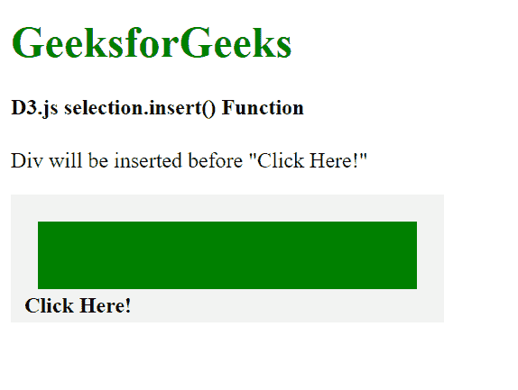
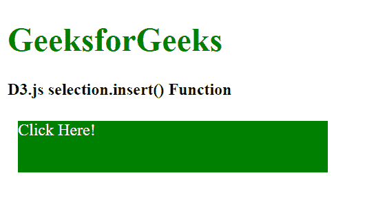
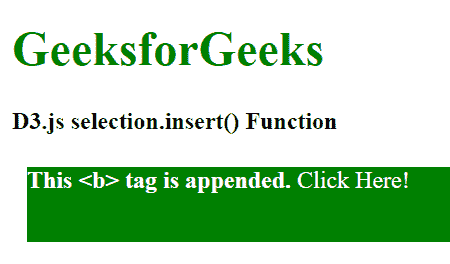

# D3.js 选择.插入()功能

> 原文:[https://www . geesforgeks . org/D3-js-selection-insert-function/](https://www.geeksforgeeks.org/d3-js-selection-insert-function/)

**selection.insert()** 函数用于在指定位置追加给定类型的新元素。它为每个选定的元素在选择器前插入一个新元素。

**语法:**

```
selection.insert(type[, before]);
```

**参数:**该函数取两个参数，上面给出，下面描述:

*   **类型:**是定义元素类型的字符串。
*   **before:** 是定义一个元素的字符串，在这个元素之前插入一个新元素。

**返回值:**这个函数必须返回新元素插入之前的子元素。

**示例 1:** 当元素插入到所选内容的所有元素之前时。

## 超文本标记语言

```
<!DOCTYPE html>
<html lang="en">

<head>
    <meta charset="UTF-8">
    <meta name="viewport" path1tent=
        "width=device-width, initial-scale=1.0">

    <script src="https://d3js.org/d3.v4.min.js">
    </script>

    <style>
        h1 {
            color: green;
        }

        p {
            background-color: #f2f2f2;
            padding: 10px;
            width: 300px;
            line-height: 5px;
        }

        p:hover {
            background-color: grey;
            padding: 10px;
            cursor: pointer;
        }

        div {
            height: 50px;
            background-color: green;
            margin: 10px;
        }
    </style>
</head>

<body>
    <h1>GeeksforGeeks</h1>

    <h4>D3.js selection.insert() Function</h4>

    <span>
        Div will be inserted before "Click Here!"
    </span>
    <p id="p"><b>Click Here!</b></p>

    <script>
        function func() {
            // Selecting all p and appending a DIV
            // before the b tag to each p tag
            var chk = d3.selectAll("p")
                .insert("div", "b");
        }
        clickme = document.getElementById("p");
        clickme.addEventListener("click", func);
    </script>
</body>

</html>
```

**输出:**

**点击前点击“点击此处”元素:**



**点击前点击“点击此处”元素:**



**示例 2:** 当元素插入到选择的第一个元素之前时。

## 超文本标记语言

```
<!DOCTYPE html>
<html lang="en">

<head>
    <meta charset="UTF-8">
    <meta name="viewport" path1tent=
        "width=device-width, initial-scale=1.0">

    <script src="https://d3js.org/d3.v4.min.js">
    </script>

    <style>
        h1 {
            color: green;
        }

        div {
            width: 300px;
            color: #ffffff;
            height: 50px;
            background-color: green;
            margin: 10px;
        }
    </style>
</head>

<body>
    <h1>GeeksforGeeks</h1>

    <h4>D3.js selection.insert() Function</h4>

    <div><span>Click Here!</span></div>

    <script>
        function func() {
            // Selecting div and Inserting 
            // <b> tag before <span> tag
            var div = d3.select("div")
                .insert("b", "span");
            var b = document.querySelector("b");
            b.innerText = "This <b> tag is appended. ";
        }
        btn = document.querySelector("div");
        btn.addEventListener("click", func);
    </script>
</body>

</html>
```

**输出:**

**点击“点击此处”元素前:**



**点击“点击此处”元素后:**

