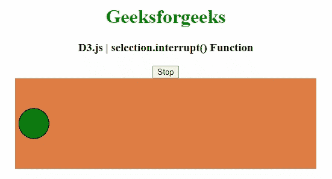
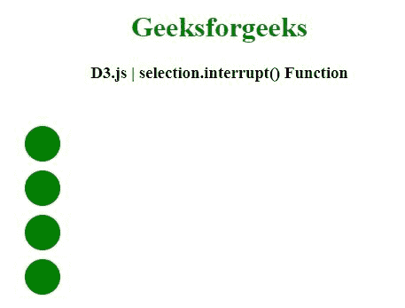

# D3.js 选择.中断()功能

> 原文:[https://www . geesforgeks . org/D3-js-selection-interrupt-function/](https://www.geeksforgeeks.org/d3-js-selection-interrupt-function/)

**D3.js** 中的**选择.中断()**功能用于中断所选元素上指定名称的活动转换，并取消任何具有指定名称的未决转换。

**语法:**

```
selection.interrupt([name])

```

**参数:**该功能接受如下参数，如上所述，如下所述:

*   **名称:**此参数为过渡实例。

**返回值:**该函数用指定的名称返回给定选择的新转换。

以下程序说明了 **D3.js.** 中的**选择.中断()**功能

**例 1:**

```
<!DOCTYPE html> 
<html> 

<head> 
    <meta charset="utf-8">
    <script src="https://d3js.org/d3.v5.min.js"> 
    </script>

    <style>
        svg {
          background-color: #de7d45;
          display: block;
        };
    </style>
</head> 

<body> 
    <center>
        <h1 style="color: green;"> 
            Geeksforgeeks 
        </h1> 

        <h3>D3.js | selection.interrupt() Function</h3>

        <button>Stop</button>
        <svg width="500" height="150"></svg>

        <script>
            const svg = d3.select("svg");
            const local = d3.local();
            const button = d3.select("button");
            const circle = svg.append("circle")
                .attr("r", 25)
                .attr("cx", 30)
                .attr("cy", 75)
                .style("fill", "green")
                .style("stroke", "black");

            circle.transition()
                .delay(5000)
                .duration(10000)
                .ease(d3.easeLinear)
                .attr("cx", 580)
                .on("interrupt", function() {
                    local.set(this, +d3.select(this)
                    .attr("cx"))
                });

            button.on("click", function() {
                if (d3.active(circle.node())) {
                    circle.interrupt();
                    this.textContent = "Resume";
                } 
                else {
                    circle.transition()
                    .ease(d3.easeLinear)
                    .duration(function() {
                        return 10000 * (560 -
                        local.get(this)) / 560;
                    })
                    .attr("cx", 580)
                    this.textContent = "Stop";
                }
            })
        </script> 
    </center>
</body>   
</html>
```

**输出:**



**例 2:**

## 超文本标记语言

```
<!DOCTYPE html> 
<html> 
<head> 
    <meta charset="utf-8">
    <script src="https://d3js.org/d3.v5.min.js"> 
    </script>
</head> 

<body> 
    <center>
        <h1 style="color: green;"> 
            Geeksforgeeks 
        </h1> 

        <h3>D3.js | selection.interrupt() Function</h3>

        <svg width="500" height="300"></svg>

        <script>
            var svg = d3.select("svg")

            var circle = svg.selectAll("circle")
                .data([1, 2, 3, 4])
                .enter()
                .append("circle")
                .style("fill", "green")
                .attr("cx", 50)
                .attr("cy", function(d) {
                    return d * 50
                })
                .attr("r", 20)
                .on("click", function() {
                    d3.select(this).interrupt()
                })

            circle.transition()
                .delay(function(d) {
                    return d * 500;
                })
                .duration(function(d) {
                    return d * 1000;
                })
                .attr("cx", 460)
                .on("interrupt", function() {
                    var elem = this;
                    var targetValue = d3.active(this)
                    .attrTween("cx")                  
                    .call(this)(1);
                    d3.select(this).attr("cx", targetValue)
                })
        </script> 
    </center>
</body> 
</html>
```

**输出:**

