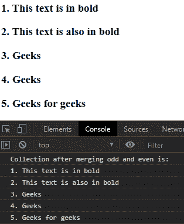
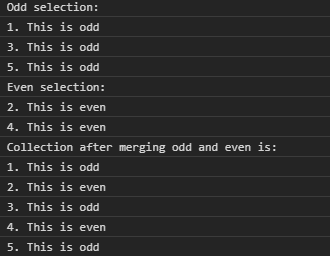

# D3.js 选择.合并()功能

> 原文:[https://www . geesforgeks . org/D3-js-selection-merge-function/](https://www.geeksforgeeks.org/d3-js-selection-merge-function/)

d3.js 中的 **selection.merge()** 函数用于将两个给定的选择合并为一个，合并后返回新的选择。返回的选择与此选择具有相同数量的组和相同的父项。

**语法:**

```
selection.merge(other);
```

**参数:**该功能接受单个参数**其他描述选择的**进行合并。

**返回值:**该函数返回一个选择。

**例 1:**

## 超文本标记语言

```
<!DOCTYPE html>
<html lang="en">

<head>
    <meta charset="UTF-8">
    <meta name="viewport" path1tent="width=device-width, 
                    initial-scale=1.0">
    <script src="https://d3js.org/d3.v4.min.js">
    </script>
    <script src=
        "https://d3js.org/d3-selection.v1.min.js">
    </script>
</head>

<body>
    <div>
        <h3>1\. This text is in bold</h3>
        <h3>2\. This text is also in bold</h3>
        <h3>3\. Geeks</h3>
        <h3>4\. Geeks</h3>
        <h3>5\. Geeks for geeks</h3>
    </div>

    <script>
        // Filtering odd children
        const odd = d3.selectAll("h3")
            .select(function (d, i) {
                return i & 1 ? this : null;
            });

        // Filtering even children
        const even = d3.selectAll("h3")
            .select(function (d, i) {
                return i & 1 ? null : this;
            });

        // Merging both selections
        const merged = odd.merge(even).nodes();

        // Printing text content
        console.log(
"Collection after merging odd and even is:")
        merged.forEach((e) => {
            console.log(e.textContent);
        });
    </script>
</body>

</html>
```

**输出:**



**例 2:**

## 超文本标记语言

```
<!DOCTYPE html>
<html lang="en">

<head>
    <meta charset="UTF-8">
    <meta name="viewport" path1tent="width=device-width, 
                    initial-scale=1.0">

    <script src="https://d3js.org/d3.v4.min.js">
    </script>
    <script src=
        "https://d3js.org/d3-selection.v1.min.js">
    </script>
</head>

<body>
    <div>
        <h5>1\. This is odd</h5>
        <h5>2\. This is even</h5>
        <h5>3\. This is odd</h5>
        <h5>4\. This is even</h5>
        <h5>5\. This is odd</h5>
    </div>

    <script>
        // Filtering odd children
        var even = d3.selectAll("h5")
            .select(function (d, i) {
                return i & 1 ? this : null
            });

        // Filtering even children
        var odd = d3.selectAll("h5")
            .select(function (d, i) {
                return i & 1 ? null : this
            });

        // Merging both selections
        const merged = odd.merge(even).nodes();
        even = even.nodes();
        odd = odd.nodes();
        console.log("Odd selection: ")
        odd.forEach((e) => {
            console.log(e.textContent);
        });
        console.log("Even selection: ")
        even.forEach((e) => {
            console.log(e.textContent);
        });
        // Printing text content
        console.log(
"Collection after merging odd and even is:")
        merged.forEach((e) => {
            console.log(e.textContent);
        });
    </script>
</body>

</html>
```

**输出:**

