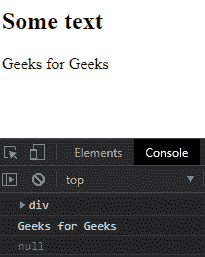
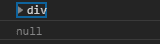

# D3.js 选择. node()功能

> 原文:[https://www . geesforgeks . org/D3-js-selection-node-function/](https://www.geeksforgeeks.org/d3-js-selection-node-function/)

D3.js 中的 **selection.node()** 函数用于返回选择中的第一个元素。如果选择不包含任何元素，则返回 null。

**语法:**

```
selection.node()
```

**参数:**此功能不接受任何参数。

**返回值:**该函数返回选择的第一个元素。

**例 1:**

## 超文本标记语言

```
<!DOCTYPE html>
<html lang="en">

<head>
    <meta charset="UTF-8">
    <meta name="viewport" path1tent=
        "width=device-width,initial-scale=1.0">
    <script src="https://d3js.org/d3.v4.min.js">
    </script>
    <script src=
    "https://d3js.org/d3-selection.v1.min.js">
    </script>
</head>

<body>
    <h2>Some text</h2>
    <div>Geeks for Geeks </div>

    <script>
        let selection = d3.selectAll("div")
        let div = selection.node();
        console.log(div)

        // Printing innerHTML of the tag
        console.log(div.innerHTML)
        selection = d3.selectAll("h1")

        // Null is returned
        console.log(selection.node())
    </script>
</body>

</html>
```

**输出:**



**例 2:**

## 超文本标记语言

```
<!DOCTYPE html>
<html lang="en">

<head>
    <meta charset="UTF-8">
    <meta name="viewport" path1tent=
        "width=device-width,initial-scale=1.0">
    <script src="https://d3js.org/d3.v4.min.js">
    </script>
    <script src=
    "https://d3js.org/d3-selection.v1.min.js">
    </script>
</head>

<body>
    <div>Some text</div>
    <div>Geeks for <div>geeks</div>
    </div>
    <div>Geeks <div></div> for geeks</div>
    <div>Some text</div>

    <script>
        let selection = d3.selectAll("div")
        console.log(selection.node())
        selection = d3.selectAll("h2")

        // Null is returned
        console.log(selection.node())
    </script>
</body>

</html>
```

**输出:**

