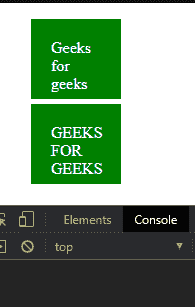
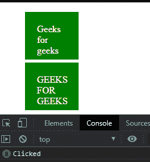
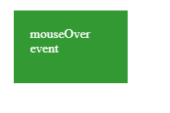
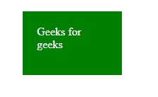

# D3.js 选择开启()功能

> 原文:[https://www.geeksforgeeks.org/d3-js-selection-on-function/](https://www.geeksforgeeks.org/d3-js-selection-on-function/)

D3.js 中的 **d3.selection.on()** 函数用于向元素添加特定的事件侦听器。事件可以是点击、鼠标悬停等事件类型的字符串。

**语法:**

```
selection.on(typenames[, listener[, options]])

```

**参数:**该函数接受两个参数，如上所述，如下所述:

*   **Typename Listener:** 是点击、提交等字符串事件类型。
*   **选项:**这是一个可选对象，可以讲述听者的特殊特征。

**注意:**如果没有指定监听器，那么它返回当前为特定元素分配的事件。

**返回值:**该函数返回对象。

下面的例子说明了 JavaScript 中的 D3.js selection.on()函数:

**示例 1:**

## 超文本标记语言

```
<!DOCTYPE html>
<html lang="en">
    <head>
        <meta charset="UTF-8" />
        <meta
            name="viewport"
            path1tent="width=device-width, 
                       initial-scale=1.0"/>
        <title>D3.js selection.on() Function</title>
    </head>
    <style>
        li {
            background-color: green;
            color: #ffffff;
            width: 50px;
            margin-bottom: 5px;
            padding: 20px;
            height: 40px;
        }
        li:hover {
            cursor: pointer;
            opacity: 0.8;
        }
    </style>
    <body>
        <ul>
            <li>Geeks for geeks</li>
            <li>GEEKS FOR GEEKS</li>
        </ul>
        <script src=
"https://d3js.org/d3.v4.min.js">
        </script>
        <script src=
"https://d3js.org/d3-selection.v1.min.js">
        </script>
        <script>
            let li = d3.select("li");
            let x = li.on("click", () => {
                console.log("Clicked");
            });
        </script>
    </body>
</html>
```

**输出:**

**点击框前:**



**点击框后:**



**例 2:**

## 超文本标记语言

```
<!DOCTYPE html>
<html lang="en">
    <head>
        <meta charset="UTF-8" />
        <meta
            name="viewport"
            path1tent="width=device-width, 
                       initial-scale=1.0"/>
        <title>D3.js selection.on() Function</title>
    </head>
    <style>
        li {
            background-color: green;
            color: #ffffff;
            width: 100px;
            margin-bottom: 5px;
            padding: 20px;
            height: 50px;
        }
        li:hover {
            cursor: pointer;
            opacity: 0.8;
        }
    </style>
    <body>
        <ul>
            <li>Geeks for geeks</li>
        </ul>
        <script src=
"https://d3js.org/d3.v4.min.js">
        </script>
        <script src=
"https://d3js.org/d3-selection.v1.min.js">
        </script>
        <script>
            let li = d3.select("li");
            let x = li.on("mouseover", () => {
                let li = document.querySelector("li");
                li.innerHTML = "mouseOver event";
            });
            // When cursor moves out of the li tag
            x = li.on("mouseout", () => {
                let li = document.querySelector("li");
                li.innerHTML = "Geeks for geeks";
            });
        </script>
    </body>
</html>
```

**输出:**

**鼠标悬停时:**



**鼠标退出时:**

