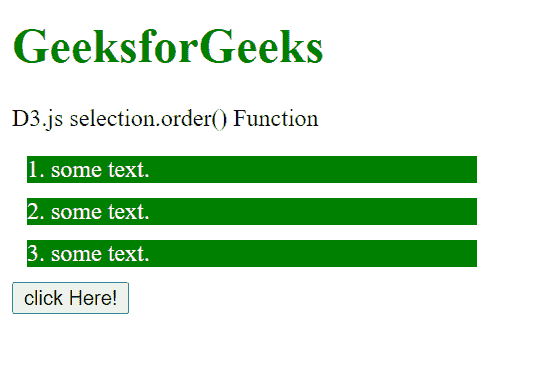
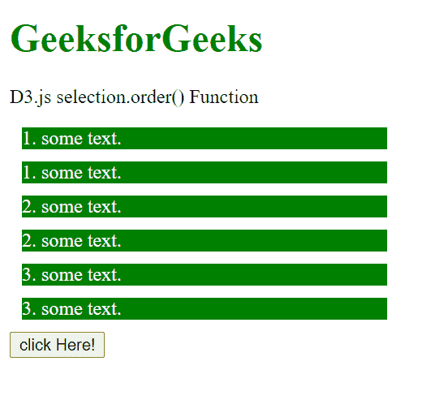
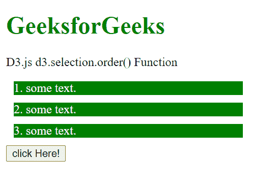
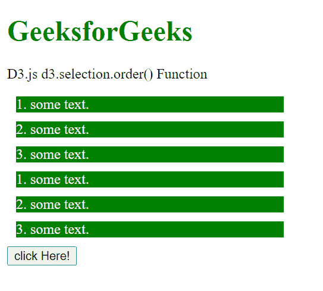

# D3.js 选择.顺序()功能

> 原文:[https://www . geesforgeks . org/D3-js-selection-order-function/](https://www.geeksforgeeks.org/d3-js-selection-order-function/)

**selection.order()** 功能用于再次插入选择，使每组的顺序与选择顺序相匹配。

**语法:**

```
selection.order();
```

**参数:**此功能不接受任何参数。

**返回值:**这个函数不返回任何东西。

**例 1:** 使用 selection.clone()方法，不使用 selection.order()方法。

## 超文本标记语言

```
<!DOCTYPE html>
<html lang="en">

<head>
    <meta charset="UTF-8">
    <meta name="viewport" path1tent="width=device-width,
                    initial-scale=1.0">
    <script src="https://d3js.org/d3.v4.min.js">
    </script>

    <style>
        div {
            width: 300px;
            color: #ffffff;
            height: auto;
            background-color: green;
            margin: 10px;
        }
    </style>
</head>

<body>
    <h1 style="color:green;">
        GeeksforGeeks
    </h1>

<p>D3.js selection.order() Function</p>

    <div><span>1\. some text.</span></div>
    <div><span>2\. some text.</span></div>
    <div><span>3\. some text.</span></div>
    <button class="btn">click Here!</button>

    <script>
        function func1() {

            // Selecting div and Cloning the
            // divs
            // Inserting them just after the
            // element But no arranging in
            // original order.
            var div = d3.selectAll("div")
                        .clone(true)
        }
        btn = document.querySelector(".btn");
        btn.addEventListener("click", func1);

    </script>
</body>

</html>
```

**输出:**

*   **点击按钮前:**



*   **点击按钮后:**请注意，元素的插入顺序与之前不同，即 1 紧接在 1 之后插入，2 紧接在 2 之后插入，以此类推。



**例 2:** 使用 selection.clone()和 selection.order()方法。

## 超文本标记语言

```
<!DOCTYPE html>
<html lang="en">

<head>
    <meta charset="UTF-8">
    <meta name="viewport" path1tent="width=device-width,
                    initial-scale=1.0">
    <script src="https://d3js.org/d3.v4.min.js">
    </script>

    <style>
        div {
            width: 300px;
            color: #ffffff;
            height: auto;
            background-color: green;
            margin: 10px;
        }
    </style>
</head>

<body>
    <h1 style="color:green;">
        GeeksforGeeks
    </h1>

<p>D3.js d3.selection.order() Function</p>

    <div><span>1\. some text.</span></div>
    <div><span>2\. some text.</span></div>
    <div><span>3\. some text.</span></div>
    <button class="btn">click Here!</button>

    <script>
        function func1() {
            // Selecting  div and
            // Cloning the divs
            // But also arranging in original order.
            var div = d3.selectAll("div")
                .clone(true)
                .order();
        }
        btn = document.querySelector(".btn");
        btn.addEventListener("click", func1);

    </script>
</body>

</html>
```

**输出:**

*   **点击按钮前:**



*   **点击按钮后:**请注意，元素的顺序与之前完全相同，即 1、2、3 和 1、2、3。

