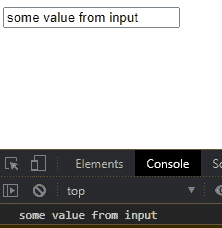
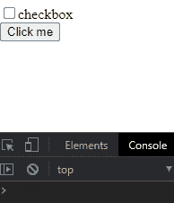
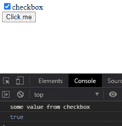

# D3.js 选择. property()函数

> 原文:[https://www . geesforgeks . org/D3-js-selection-property-function/](https://www.geeksforgeeks.org/d3-js-selection-property-function/)

**selection.property()** 功能用于设置或更改特定元素的属性和值。特定属性的值可以通过将其值设置为 null 来删除。

**语法:**

```
selection.property(name[, value]);
```

**参数:**该函数接受两个参数，如上所述，如下所述:

*   **名称:**要设置的属性的名称。
*   **值:**要设置的属性值。

**返回值:**该函数不返回值。

**例 1:**

## 超文本标记语言

```
<!DOCTYPE html>
<html lang="en">

<head>
    <meta charset="UTF-8">
    <meta name="viewport" path1tent=
        "width=device-width, initial-scale=1.0">

    <script src="https://d3js.org/d3.v4.min.js">
    </script>
</head>

<body>
    <div>
        <input type="text">
    </div>

    <script>

        // Sets value property of the the input tag
        var input = d3.select("input")
            .property("value", "some value from input");
        var text = document.querySelector("input");

        // Value from input 
        console.log(text.value);
    </script>
</body>

</html>
```

**输出:**



**例 2:**

## 超文本标记语言

```
<!DOCTYPE html>
<html lang="en">

<head>
    <meta charset="UTF-8">
    <meta name="viewport" path1tent=
        "width=device-width, initial-scale=1.0">

    <script src="https://d3js.org/d3.v4.min.js">
    </script>
</head>

<body>
    <div>
        <input type="checkbox" class="checkbox" 
            name="" id="">checkbox<br>

        <button>Click me</button>
    </div>

    <script>
        function func() {

            // Sets checked and value property
            // of the the checkbox
            var chk = d3.select(".checkbox").property(
                "value", "some value from checkbox");
            var chk = d3.select(".checkbox")
                .property("checked", true);
            var text = document.querySelector(".checkbox");

            // Value from checkbox
            console.log(text.value);
            console.log(text.checked);
        }

        let btn = document.querySelector("button");
        btn.addEventListener("click", func);
    </script>
</body>

</html>
```

**输出:**

*   **点击“点击我”按钮前:**

    

*   **点击“点击我”按钮后:**

    